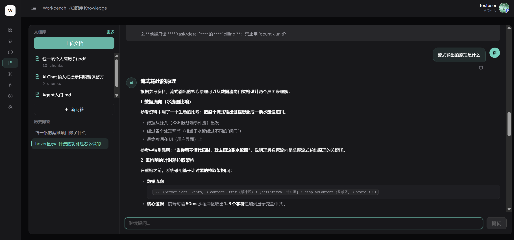
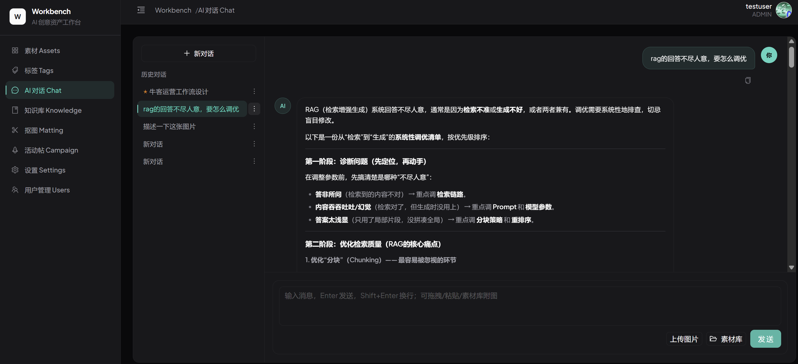
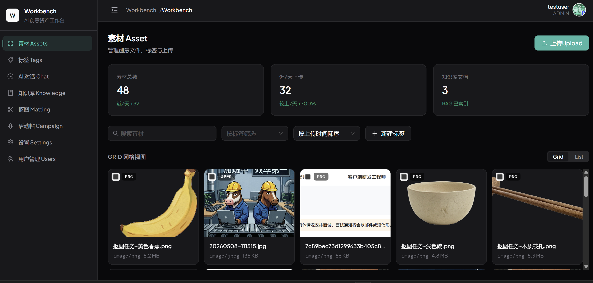
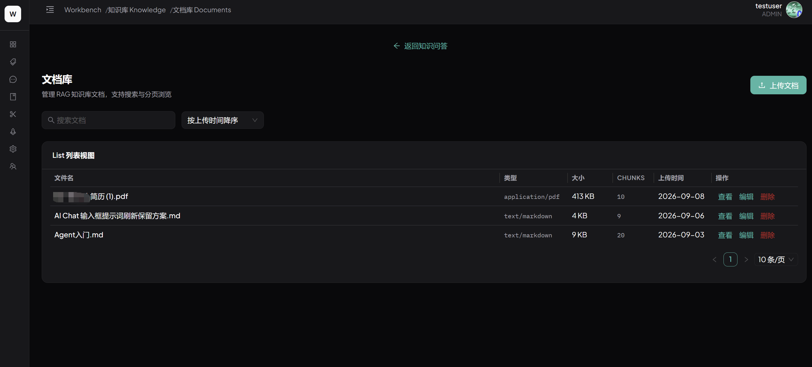
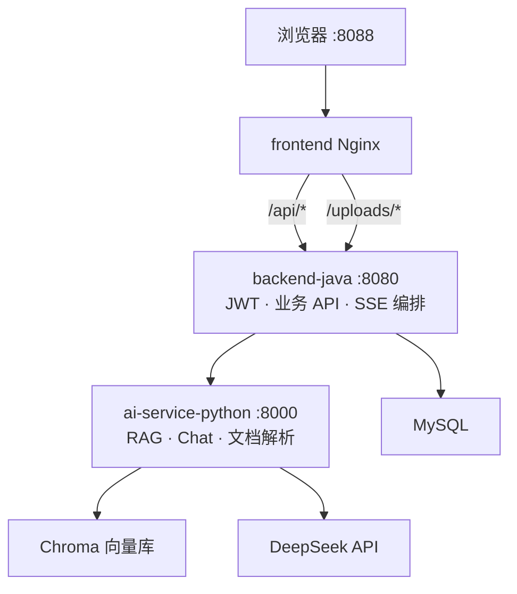

# AI Creative Workbench

面向游戏 / 美术 / 运营团队的 **AI 创意素材与知识工作台**：素材管理、知识库 RAG 问答、AI 对话（SSE 流式 + 多模态）、Campaign / 抠图等工作流辅助。

**公网 Demo：** http://8.148.238.164:8088

**产品截图导览：** [`docs/portfolio.md#产品截图导览`](docs/portfolio.md#产品截图导览)（逐页说明 + 占位图）

**作品说明（投递用）：** [`docs/portfolio.md`](docs/portfolio.md)  
**简历项目经历（可直接复制）：** [`docs/resume-project.md`](docs/resume-project.md)  
**架构详解：** [`docs/architecture.md`](docs/architecture.md)  
**面试 STAR：** [`docs/interview.md`](docs/interview.md)

---

## 核心能力

| 模块 | 说明 |
|------|------|
| **素材库** | 上传、标签、Grid/List、懒加载；2G ECS 下 N+1 优化与分页 |
| **知识库 RAG** | 4 格式入库 → 语义 chunk → hybrid+rerank → 流式问答 + 引用；👍👎 反馈闭环 |
| **AI Chat** | SSE 流式输出；虚拟列表 + 流式双模式；可选参考图多模态 |
| **Campaign / 抠图** | 活动帖配图、AI 方案生成、Matting 任务侧栏 |
| **工程化** | Docker 四服务、GitHub Actions CI/CD、GHCR → ECS 一键部署 |

### 产品界面（截图占位）

放入 [`docs/screenshots/`](docs/screenshots/) 后下方自动显示。拍摄清单见 [`docs/screenshots/README.md`](docs/screenshots/README.md)。

| | |
|:---:|:---:|
|  |  |
| *知识库 · RAG + references* | *Chat · SSE 流式* |
|  |  |
| *素材 · Grid + 标签* | *文档库 · pdf/docx 入库* |

更多页面（标签、上传、抠图、Campaign、设置等）→ [`portfolio.md#产品截图导览`](docs/portfolio.md#产品截图导览)

---

## 技术栈

| 层 | 技术 |
|----|------|
| 前端 | React 19、TypeScript、Vite、Ant Design 6、TanStack Virtual、CSS Modules |
| 业务后端 | Java 17、Spring Boot 3、MyBatis-Plus、JWT、SSE 转发 |
| AI 服务 | Python 3.11、FastAPI、Chroma、手写 RAG（embed + 检索 + LLM） |
| 基础设施 | MySQL 8、Nginx、Docker Compose、GitHub Actions、阿里云 ECS |

---

## 架构概览



**分层原则：** 前端只调 Java；Java 负责鉴权、事务、文件与编排；Python 专注 AI 能力（不直连前端）。

---

## 快速启动

| 模式 | 说明 |
|------|------|
| **本地开发** | Python `:8000` → Java `:8080` → 前端 `pnpm dev :5173` |
| **Docker 一键** | 根目录 `docker compose up -d` → http://localhost:8088 |

完整步骤、环境变量、ECS 部署与排障 → [`docs/deploy.md`](docs/deploy.md)

### 最小本地命令

```bash
# 1. Python AI（需 ai-service-python/.env 配置 MODEL_API_KEY）
cd ai-service-python && uvicorn app.main:app --reload --port 8000

# 2. Java 后端
cd backend-java && mvn spring-boot:run

# 3. 前端
cd frontend && pnpm install && pnpm dev
```

---

## 目录结构

```
ai-creative-workbench/
├── frontend/                 # React + Vite
├── backend-java/             # Spring Boot BFF
├── ai-service-python/        # FastAPI AI 层
├── docs/
│   ├── portfolio.md          # 作品说明（Wave C）
│   ├── architecture.md       # 架构说明
│   ├── interview.md          # 面试 STAR
│   ├── rag-eval.md           # RAG 策略与评测
│   ├── deploy.md             # 部署指南
│   ├── project-roadmap.md    # 迭代计划
│   └── dev-log/              # 开发复盘
├── docker-compose.yml
└── .github/workflows/        # CI + CD
```

---

## 文档索引

| 文档 | 用途 |
|------|------|
| [`docs/portfolio.md`](docs/portfolio.md) | 简历 / 飞书作品入口：问题、贡献、方案、验证、迭代 |
| [`docs/architecture.md`](docs/architecture.md) | 服务分工、核心链路、数据与安全 |
| [`docs/interview.md`](docs/interview.md) | 8 个可背诵 STAR 故事 |
| [`docs/rag-eval.md`](docs/rag-eval.md) | RAG chunk/TopK、验收用例、bad case |
| [`docs/project-roadmap.md`](docs/project-roadmap.md) | Phase / Wave 计划与完成状态 |
| [`docs/dev-log/`](docs/dev-log/) | 功能级开发复盘（Chat、CD、RAG 等） |

---

## 个人定位（简历一句话）

> 前端工程背景的全栈 AI 应用开发者：React 流式交互 + Java BFF 工程闭环 + Python 手写 RAG，独立交付可公网演示的三端项目。

---

## License

Private / portfolio project — 面试演示用途。
