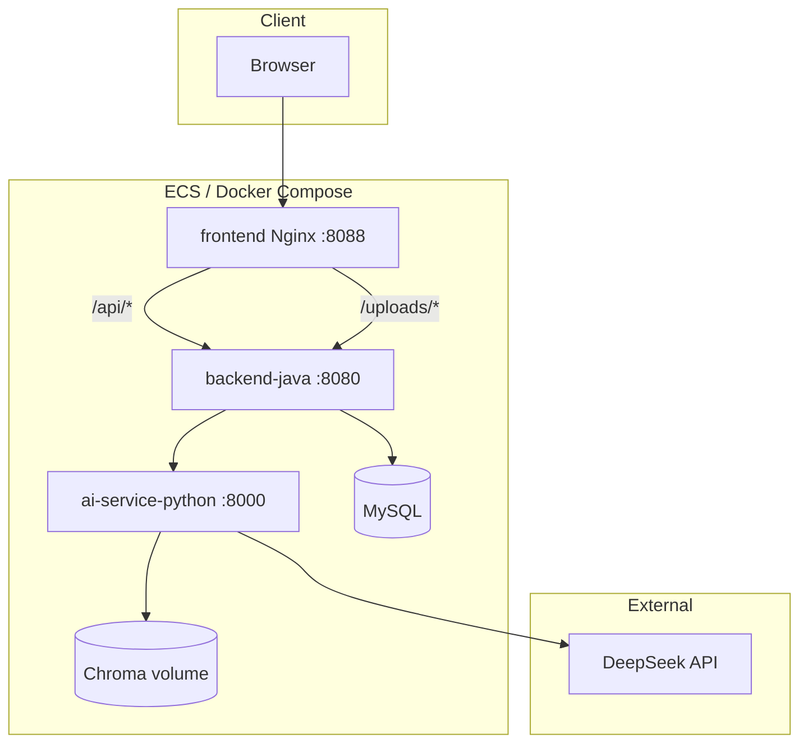
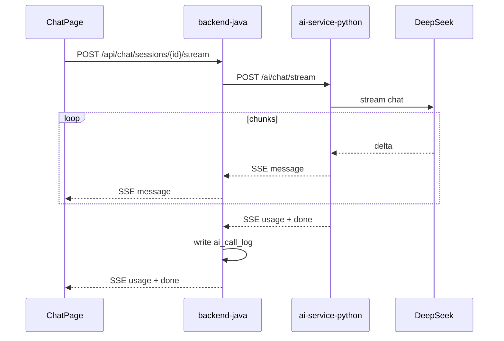
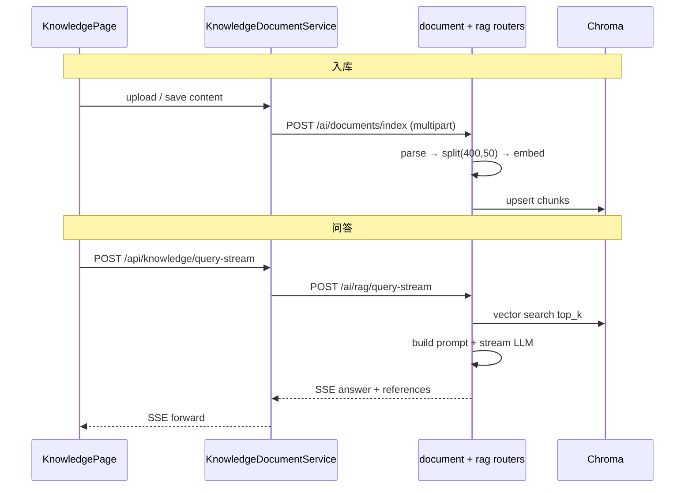
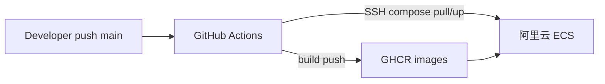

# 架构说明

> AI Creative Workbench 正式架构文档（Wave C）。  
> 简版见 [`java-python-architecture.md`](java-python-architecture.md)。

---

## 1. 设计目标

| 目标 | 做法 |
|------|------|
| **职责清晰** | 前端 UI；Java 业务与编排；Python AI 能力 |
| **可演示** | Docker Compose 四服务；公网 ECS Demo |
| **可讲解** | 手写 RAG、SSE 链路、CD 流水线均有 dev-log |
| **可控边界** | 不做微服务注册中心；RAG 无 OCR；Agent/MCP 留 Phase 3 |

---

## 2. 系统总览

### 2.1 服务职责

| 服务 | 端口 | 职责 |
|------|------|------|
| **frontend** | 8088（Nginx） | 静态资源；反向代理 `/api`、`/uploads` |
| **backend-java** | 8080 | JWT、用户/素材/知识库/会话、文件存储、调用 Python、SSE 转发、`ai_call_log` |
| **ai-service-python** | 8000 | Chat 流式、Embedding、Chroma、文档 parse/chunk/index、RAG query-stream |
| **mysql** | 3306（容器内） | 业务数据 |

### 2.2 为何不直连 Python？

- **安全：** API Key 与向量库仅在 Python 容器；前端无 Token 访问 AI 层。
- **一致：** 401/403/业务异常统一由 Java `Result` + 全局异常处理返回。
- **事务：** 上传文件、写 DB、触发 index 可在 Java 侧编排与回滚。

---

## 3. 核心链路

### 3.1 Chat SSE（流式对话）

**前端要点：** 流式阶段关闭虚拟列表（flex + ResizeObserver）；结束后恢复 TanStack Virtual。见 [`dev-log/2026-09-chat-streaming-virtual-list.md`](dev-log/2026-09-chat-streaming-virtual-list.md)。

### 3.2 知识库 RAG

**解析分支：**

| 后缀 | 处理 |
|------|------|
| `.md` / `.txt` | UTF-8 解码 |
| `.pdf` | pypdf 提取文本 |
| `.docx` | docx2txt（含文本框/页眉页脚） |

### 3.3 文件与静态资源

- 上传文件存 Java 侧 volume（`/uploads`）。
- 公网访问经 Nginx `http://<host>:8088/uploads/...`（`APP_PUBLIC_BASE_URL` 必须与浏览器入口一致，否则图片 502/空白）。

---

## 4. 数据存储

| 存储 | 内容 |
|------|------|
| **MySQL** | 用户、素材、标签、知识库文档元数据、Chat 会话与消息、`ai_call_log` 等 |
| **Chroma** | 文档 chunk 向量 + metadata（`source`, `document_id`, `index`） |
| **本地 volume** | 上传文件、Chroma 持久化目录 |

---

## 5. 安全与配置

| 项 | 说明 |
|----|------|
| **鉴权** | JWT；前端 axios 拦截 401 跳登录 |
| **密钥分层** | 仓库无 DB 密码 / JWT 明文；ECS `.env.secrets` + `ai-service-python/.env` |
| **YAML 陷阱** | `application.yml` 禁止 `password: *` 占位（SnakeYAML 解析失败 → backend Exited → 502） |
| **演示** | 公网 Demo 使用独立 API Key；敏感文件不进 Git |

---

## 6. 部署架构（Wave A CD）

- **CI：** 三 job 编译（Java / Python / Frontend）。
- **CD：** workflow_dispatch；镜像 tag = commit SHA + latest；ECS `git pull` + `docker compose pull/up`。
- 详见 [`dev-log/2026-09-github-actions-cd.md`](dev-log/2026-09-github-actions-cd.md)、[`deploy.md`](deploy.md) §12。

---

## 7. 前端工程要点

| 项 | 实现 |
|----|------|
| 设计体系 | Studio Neutral（Ink `#18181B` + Teal `#0D9488`） |
| 路由 | 大页 `React.lazy` + `Suspense`（`lazyPages.ts`） |
| 错误 | `parseApiError` + 全局 toast 去重 |
| 长列表 | Chat 虚拟列表；素材 Grid 懒加载 / IntersectionObserver |

---

## 8. 演进路线（未做 / Phase 3）

| 方向 | 说明 |
|------|------|
| HTTPS + 域名 | Wave A · 1-F（备案后） |
| Tool Calling / MCP | Phase 3 · Agent 关键词 |
| AI 反馈闭环 | 点赞点踩 → 效果统计 |
| OCR | 扫描版 PDF/DOCX，需 Tesseract/PaddleOCR |
| Redis | 限流 / 热点缓存（按需） |

**刻意不做：** Nacos、Spring Cloud Gateway、Spring AI 替换 Python 层、Kafka 全链路。

---

## 9. 关键代码入口

| 模块 | 路径 |
|------|------|
| Java Python 客户端 | `backend-java/.../PythonAiClient.java` |
| 知识库服务 | `backend-java/.../KnowledgeDocumentService.java` |
| 文档解析 | `ai-service-python/app/services/document_parser.py` |
| 二进制提取 | `ai-service-python/app/services/binary_document_extractor.py` |
| RAG 问答 | `ai-service-python/app/services/rag_service.py` |
| Chat 流式 | `ai-service-python/app/routers/chat.py` |
| 前端 Chat | `frontend/src/pages/ChatPage.tsx` |
| CD Workflow | `.github/workflows/deploy.yml` |
