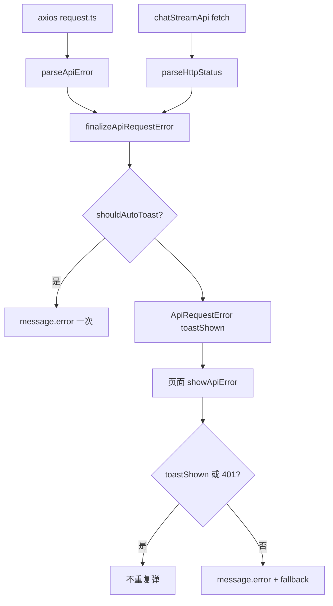

# 路由 Lazy Load + 统一 API 错误体验

> 2026-09 · AI Creative Workbench · 面试向开发复盘  
> Roadmap：Phase 1 · #3 Week 13（F2 + F4）

## 1. 背景与目标

**用户痛点**

- 首屏打包进 Chat / Knowledge / Matting / Campaign 等大页，进入 `/assets` 也下载无关 JS。
- axios / fetch 失败时提示为 `Network Error`、`timeout of 15000ms exceeded` 等英文，或各页面 `catch` 文案不一致。
- 断网、502 时有的页面静默失败，有的与拦截器 **双 toast**。

**目标**

1. 业务大页 **按需加载**（code splitting），首屏 bundle 减小。
2. **统一错误解析**（401/超时/502/413/断网）→ 中文可理解文案。
3. 基础设施类错误 **全局 toast 一次**；页面 `showApiError` 不重复弹。

---

## 2. 方案选型

| 决策点 | 选型 | 理由 |
|--------|------|------|
| Lazy 挂载点 | `MainLayout` 内 `Suspense` 包住 `<Outlet />` | Shell/Sidebar 同步加载；仅路由子树 lazy |
| Lazy 声明位置 | 独立 `router/lazyPages.ts` | 避免 `router/index.tsx` 的 `react-refresh/only-export-components` 警告 |
| 哪些页 lazy | Chat、Knowledge 三页、Matting、Campaign、AdminUsers | 体积大、非首屏；`/assets` 保持同步 |
| 错误解析 | 纯函数 `parseApiError` + `parseHttpStatus` | axios 与 fetch/SSE 共用规则 |
| 副作用收敛 | `finalizeApiRequestError` | 401 跳转、502/断网 auto toast，axios 与 `chatStreamApi` 一致 |
| 页面展示 | `showApiError(err, fallback)` | `toastShown` / `unauthorized` 时跳过，防双弹窗 |

**放弃的方案**

- 在 `router/index.tsx` 内直接 `lazy()`：与 `export router` 混文件，Fast Refresh ESLint 报错。
- 拦截器里对所有错误都 `message.error`：与页面 catch 双 toast。
- 各页面继续 `message.error(err.message)` 不改造：英文 axios 原文仍会出现。

---

## 3. 关键实现

### 3.1 Lazy Load 链路

```
MainLayout
  └── Suspense (Spin fallback)
        └── Outlet
              └── lazyPages.ts → dynamic import → 独立 chunk
```

- [`lazyPages.ts`](../../frontend/src/router/lazyPages.ts)：7 个大页 `React.lazy(() => import(...))`。
- [`MainLayout.tsx`](../../frontend/src/layouts/MainLayout.tsx)：`Suspense` + `.routeFallback` 居中 Spin。
- [`router/index.tsx`](../../frontend/src/router/index.tsx)：只 import lazy 组件与同步登录/素材页。

### 3.2 错误体验分层



- [`apiError.ts`](../../frontend/src/utils/apiError.ts)：`ApiRequestError`、`handleUnauthorized`、`Failed to fetch` → 中文网络异常。
- [`request.ts`](../../frontend/src/api/request.ts)：成功/失败拦截器调用 `finalizeApiRequestError`。
- [`chat.ts`](../../frontend/src/api/chat.ts)：`fetch` try/catch + `!res.ok` 走同一套 finalize（修复 SSE 401 不跳转、断网英文）。
- [`ChatPage.tsx`](../../frontend/src/pages/ChatPage.tsx)、[`AssetListPage.tsx`](../../frontend/src/pages/AssetListPage.tsx)：API catch 改 `showApiError`；剪贴板复制仍用 `message.error`（非 API）。

---

## 4. 踩坑与思考

| 现象 | 根因 | 最终解法 |
|------|------|----------|
| `only-export-components` on router | `lazy()` 与 `export router` 同文件 | 抽到 `lazyPages.ts` |
| 断网双 toast | 拦截器 + 页面都 `message.error` | `toastShown` + `showApiError` 跳过 |
| SSE 401 不跳登录 | fetch 不经过 axios 拦截器 | `finalizeApiRequestError` 内 `handleUnauthorized` |
| Chat 复制失败用 showApiError | 非 API 错误 | 改回 `message.error` |
| `Failed to fetch` 仍英文 | 普通 Error 未映射 | `parseApiError` 识别该字符串 |

**未改（已知可接受）**

- ChatPage 挂载 `loadConversations` 的 `set-state-in-effect` ESLint：React 19 严格规则，功能正常，后续可改 async 回调写法。
- Matting/Campaign 等页仍用旧 `message.error`：可逐步迁移 `showApiError`。

---

## 5. 验收清单

- [x] `pnpm build` 成功，`dist/assets/` 多 chunk（Chat/Matting 等独立 js）
- [x] 首屏 `/assets` 不加载 Chat chunk；进 `/chat` 按需加载
- [x] 停 backend：素材页 **1 条**「网络异常…」toast
- [x] Chat 流式、侧栏、保存正常
- [x] `pnpm exec tsc --noEmit` 通过

---

## 6. 面试话术（STAR）

- **Code splitting**：非首屏路由（Chat、Ops、Knowledge）用 `React.lazy` + `Suspense`，声明集中在 `lazyPages.ts`；MainLayout 包 Outlet，Shell 同步加载，Vite 自动拆 chunk，首屏 JS 更小。
- **统一错误层**：`parseApiError` 把 axios 超时、502、断网映射成中文；`finalizeApiRequestError` 负责 401 跳转与基础设施类全局 toast；页面 `showApiError` 读 `toastShown` 避免双弹窗。SSE 的 fetch 走 `parseHttpStatus`，与 axios 规则一致。
- **工程化**：错误处理分「解析（纯函数）→ 副作用（finalize）→ 展示（showApiError）」三层，后续加 Knowledge 流式只需复用 finalize。

---

## 7. 关键文件

| 文件 | 作用 |
|------|------|
| `frontend/src/router/lazyPages.ts` | lazy 页面集中声明 |
| `frontend/src/layouts/MainLayout.tsx` | Suspense 边界 |
| `frontend/src/utils/apiError.ts` | 解析、finalize、showApiError |
| `frontend/src/api/request.ts` | axios 拦截器 |
| `frontend/src/api/chat.ts` | SSE fetch 错误对齐 |
| `frontend/src/pages/ChatPage.tsx` | showApiError 示范 |
| `frontend/src/pages/AssetListPage.tsx` | showApiError 示范 |
