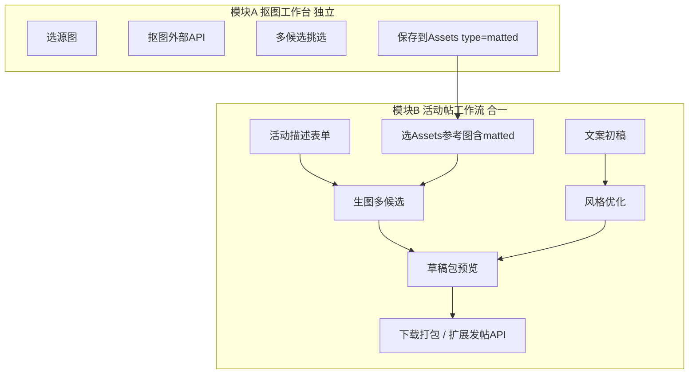
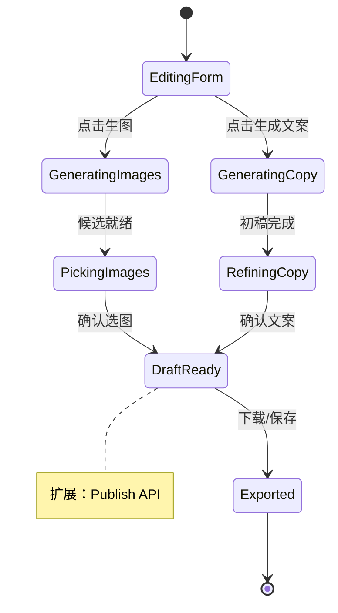

# 图文运营 AI 工作流 — 产品说明 Brief

> Week 12+ 业务与架构 Single Source of Truth。供产品讨论、设计 Agent、调研 Agent、开发 Agent 共用。  
> 关联文档：[`project-idea.md`](project-idea.md)、[`study-plan.md`](study-plan.md) 第 12 周、[`frontend-requirements.md`](frontend-requirements.md)

---

## 1. 背景与定位

### 1.1 项目一句话

**AI Creative Asset & Knowledge Workbench** — 面向游戏、美术、运营、内容团队的 AI 素材管理、知识问答、文案生成和**工作流辅助**平台。

### 1.2 本 Brief 解决什么问题

Chat（自由对话）和 Knowledge（RAG 问答）已完成。Week 12 起要证明：

> **项目不是简单 Chatbot，而是有可复用 AI 工作流。**

图文运营是第一条**端到端业务工作流**：从活动描述到 **AI 配图 + AI 文案 + 可发帖草稿包**，覆盖牛客等社区运营发帖场景。

### 1.3 与 Chatbot 的差异

| 维度 | Chat | 图文运营工作流 |
|------|------|----------------|
| 交互 | 开放式多轮对话 | 结构化表单 + 分步任务 |
| 产出 | 任意文本 | **草稿包**（文案 + 选定配图） |
| Prompt | 用户即兴 | **模板 + 变量**（可复用、可审计） |
| 图像 | 无 | 抠图入库 + 生图多候选 + 挑选 |
| 持久化 | conversation/message | campaign_draft、generation_job、Assets |

---

## 2. 双模块架构（A 抠图 / B 活动帖）

**两个独立产品面，UX 上不揉成一个页面：**

| 模块 | 路由建议 | 职责 |
|------|----------|------|
| **A. 抠图工作台 Matting** | `/ops/matting` 或 `/assets/matting` | 从原图提取透明底元素（吉祥物、道具等）→ 多候选 → **保存到 Assets** |
| **B. 活动帖工作流 Campaign Post** | `/ops/campaign` | **生图 + 文案 + 草稿预览/打包 +（扩展）发帖** 一条龙 |



**关系说明：**

- **模块 A 是上游**：抠图产物写入 Assets，供模块 B 生图时作为参考图（如牛客吉祥物）。
- **模块 B 是下游交付**：生图、文案、组装草稿在同一工作流内完成；**不把抠图做成 B 里的附属 Tab**（API 可复用，页面独立）。
- **视频运营**：不在图文 MVP；后续接入视频模型单独扩展。

**明确不做：**

- 可视化 DAG 工作流编辑器（n8n 级）
- 照抄参考项目 ai-center 的前端状态管理与 UI

---

## 3. 牛客运营场景与产出物

### 3.1 典型场景

运营在牛客发布**新活动帖**，需要：

1. **配图**：符合活动主题的宣传图（可含品牌吉祥物）
2. **文案**：标题 + 正文（风格符合社区调性）
3. **发帖**：预览后发布（MVP 人工复制；扩展 API 一键发）

### 3.2 用户故事（MVP）

> 作为牛客运营，我描述一场活动（主题、时间、福利、受众），从素材库选择已抠好的吉祥物，让 AI 生成 4 张候选宣传图并挑选 1 张，同时 AI 生成文案初稿并按「活泼/正式」风格优化，最后在应用内预览图文草稿包，下载或保存到 Assets，再复制到牛客发帖。

### 3.3 最终产出物

| 阶段 | 形态 |
|------|------|
| **MVP** | 应用内 **活动帖草稿包**：优化后文案 + 1~N 张选定配图；预览、下载 zip、写入 Assets；**人工**去牛客发帖 |
| **扩展** | 接入牛客/社区 **发帖 API**：应用内预览 → 一键发布 |
| **后续** | 视频脚本 + 视频生成（独立模块，需视频模型） |

### 3.4 草稿包内容（逻辑结构）

```json
{
  "title": "活动标题",
  "body": "正文 Markdown/纯文本",
  "images": [{ "assetId": 123, "url": "...", "role": "cover" }],
  "activityMeta": { "theme": "...", "audience": "...", "forbiddenWords": [] },
  "status": "draft | ready"
}
```

---

## 4. 模块 A 用户旅程 — 抠图工作台

**目的：为生图提供干净、可复用的透明底素材。**

| 步骤 | 用户动作 | 系统行为 |
|------|----------|----------|
| 1 | 从 Assets 选源图或上传 | 校验格式/大小；素材库含「已有素材」与「AI 生图打标入库」两子路径 |
| 2 | （可选）框选区域 / 选抠图模型 | 参考 ai-center 切割概念，Studio Neutral 重写 UI |
| 3 | 填写抠图提示（或选模板） | 调 **外部抠图 API** |
| 4 | 查看 **多候选** 结果 | 画廊展示，支持放大对比 |
| 5 | 勾选满意图 → 保存 | 写入 Assets，`assetType=matted`，打标签如 `吉祥物` |
| 6 | 取消 / 重试 | 不污染 Assets |

**验收要点：**

- 同一源图可生成多候选，只保存用户确认项
- 保存后在 Assets 列表可筛 `matted` 类型
- 模块 B 生图时可选取这些资产

---

## 5. 模块 B 用户旅程 — 活动帖工作流

**生图 + 文案 + 发布准备在同一页面（分步骤或分栏，非 Chat 气泡）。**

### 5.1 配图链路

| 步骤 | 说明 |
|------|------|
| 填活动描述 | 主题、时间、福利、受众、视觉风格、画幅比例等结构化字段 |
| 选参考图 | 直接上传，或从 Assets 选（已有素材 / AI 生图打标入库） |
| 生图 | 外部 API，**批量生成**（如 4 张） |
| 挑选 | 画廊选 1~N 张进入草稿包 |
| 保存 | 选中图可另存 Assets `generated` |

### 5.2 文案链路（两阶段）

| 阶段 | 输入 | 输出 |
|------|------|------|
| **初稿** | 活动结构化字段 | 标题 + 正文初稿（LLM，可 SSE 流式） |
| **优化** | 初稿 + **风格模板**（`prompt_template`）+ 用户自由描述 | 润色后文案 |

风格模板示例场景：`copy_style_playful`、`copy_style_formal`、`copy_style_push`（具体命名调研后定）。

### 5.3 组装与发布

| 步骤 | MVP | 扩展 |
|------|-----|------|
| 预览 | 模拟牛客帖排版（图 + 文） | 同左 |
| 下载 | zip：文案 txt/md + 图片文件 | 同左 |
| 发布 | 人工复制 | 牛客发帖 API |

### 5.4 人机协同状态机



---

## 6. 与现有系统关系

| 现有模块 | 关系 |
|----------|------|
| [**Assets**](backend-java/src/main/java/com/workbench/backendjava/controller/AssetController.java) | 上传、列表、标签；扩展 **metadata**：`assetType`: `reference` \| `matted` \| `generated` \| `draft_cover` |
| [**Chat**](frontend/src/pages/ChatPage.tsx) | 不替代；工作流内不用 Chat 布局 |
| [**Knowledge/RAG**](frontend/src/pages/KnowledgePage.tsx) | 可选：读取活动规则 PDF（MVP 可不绑） |
| **Python AI** | 编排 LLM 文案、外部生图/抠图 API |
| **Java** | 业务 CRUD、草稿持久化、转发 Python、鉴权 |

**设计规范：** Studio Neutral（[`frontend-ai-brief.md`](frontend-ai-brief.md)）；不 import `Preview*` 到业务页。

---

## 7. 数据模型草案

### 7.1 `prompt_template`（study-plan 已有方向）

```sql
CREATE TABLE prompt_template (
  id BIGINT PRIMARY KEY AUTO_INCREMENT,
  user_id BIGINT NULL,          -- NULL = 系统内置
  name VARCHAR(255) NOT NULL,
  scene VARCHAR(100) NOT NULL,  -- matting | image_gen | copy_draft | copy_style_*
  content TEXT NOT NULL,        -- 含 {{variable}} 占位符
  created_at DATETIME DEFAULT CURRENT_TIMESTAMP,
  updated_at DATETIME DEFAULT CURRENT_TIMESTAMP ON UPDATE CURRENT_TIMESTAMP,
  deleted TINYINT DEFAULT 0
);
```

### 7.2 `generation_job`（一次生图/抠图任务）

| 字段 | 说明 |
|------|------|
| id, user_id | 归属 |
| job_type | `matting` \| `image_gen` |
| status | pending / running / done / failed |
| input_json | 源 assetId、prompt、模型参数 |
| candidates_json | 候选 URL/assetId 列表 |
| selected_ids | 用户选中项 |

### 7.3 `campaign_draft`（活动帖草稿）

| 字段 | 说明 |
|------|------|
| id, user_id, title | 草稿标题（可取活动主题） |
| activity_json | 活动表单快照 |
| copy_title, copy_body | 定稿文案 |
| cover_asset_id | 主封面图 |
| image_asset_ids | 附图 JSON 数组 |
| status | draft / ready |

### 7.4 `ai_call_log`（study-plan 周五）

```sql
CREATE TABLE ai_call_log (
  id BIGINT PRIMARY KEY AUTO_INCREMENT,
  user_id BIGINT,
  scene VARCHAR(100),
  prompt TEXT,
  response TEXT,
  model VARCHAR(100),
  cost_time BIGINT,
  created_at DATETIME DEFAULT CURRENT_TIMESTAMP
);
```

### 7.5 评估（Sunday 方向，轻量）

- 生成结果：赞/踩、是否满意、重新生成原因（可选表 `ai_evaluation` 或 log 扩展字段）

---

## 8. 外部 API 依赖

| 能力 | 实现方式 | 配置 |
|------|----------|------|
| 文案 LLM | 现有 DeepSeek 链路 | `ai-service-python` `.env` |
| 抠图 | **外部 API**（rembg 自建 / 商用抠图 API / 与 ai-center 同款供应商） | Python 编排，待调研选型 |
| 生图 | **外部 API**（通义万相 / 即梦 / SD API 等） | Python 编排，待调研选型 |

**原则：**

- 不复用 ai-center 内部 yunjing/即梦 SDK 代码；在本项目用 `.env` 配置供应商。
- 抠图 prompt、模型选择**可参考** ai-center 美术机台配置思路。

**限流与成本（MVP）：**

- 单次活动生图上限 N 张（如 4~8）
- 抠图单次多候选上限 M 张（如 4）
- 失败可重试，记录 `ai_call_log`

---

## 9. Prompt 与风格资源 — 调研清单

**目标：** 将经筛选的优质 prompt **入库** `prompt_template`，而非运行时爬网。

| 来源 | 用途 | 链接 |
|------|------|------|
| awesome-chatgpt-prompts | 分类 prompt 灵感 | https://github.com/f/awesome-chatgpt-prompts |
| Langfuse Prompt Hub | 版本化 prompt 管理参考 | https://langfuse.com/docs/prompts/get-started |
| 营销/活动文案开源合集 | 运营风格模板 | 调研 Agent 补充具体 repo |
| ai-center `slots_prompt` | 抠图/生图工业级 prompt | 见 §10 |

**入库策略：**

1. 调研 Agent 输出 5~10 条**脱敏**优质模板
2. 产品确认 scene 分类
3. 开发 Agent 写 SQL seed + CRUD
4. 用户可在 UI 微调模板（扩展）

---

## 10. 参考项目 — ai-center 美术机台

### 10.1 基本信息

| 项 | 值 |
|----|-----|
| 路径 | `e:\font\.ai_completion\ai-center` |
| 模块名 | **美术机台**（slots / art machine） |
| 借鉴范围 | **工作流逻辑、后端编排、prompt/模型选择** |
| 禁止照搬 | 前端 Pinia 巨型 store、sessionStorage 镜像、Vue 机台 UI |

### 10.2 后端 — 优先参考

| 文件 | 借鉴什么 |
|------|----------|
| `backend/src/main/java/com/zengame/ai/business/slots/service/SlotsService.java` | 分阶段任务、生图多模型路由、区域/元素落库、导出 |
| `backend/src/main/java/com/zengame/ai/infrastructure/enums/SlotsStage.java` | 阶段状态机 |
| `SlotsPromptMapper` / `slots_prompt` | 抠图/生图提示词模板 |
| `SlotsPlanMapper` | 多候选方案（plan 卡片） |
| `SlotsCropRegionMapper` | 切割区域 |
| `SlotsElementMapper` / `SlotsElementImageMapper` | 元素清单与候选图 |
| `SlotsImageHistoryMapper` | 历史生成记录 |

### 10.3 五阶段 → 本项目映射

| 参考阶段 | 含义 | 本项目 |
|----------|------|--------|
| ① GENERATE | 文+参考图生整图 | **模块 B** 生图（运营宣传图） |
| ② CROP | 整图区域切割 | 可选简化；运营场景可跳过 |
| ③ EXTRACT_EDIT | 元素提取/抠图 | **模块 A** 核心 |
| ④ SELECT | 多候选选图 | **A/B 共用** 画廊 + 确认 |
| ⑤ EXPORT | 打包下载 | **模块 B** 草稿包导出 |

运营图文**不需要**完整五阶段机台 UI；抽取：**多候选生成 → 挑选 → 入库 → 打包**。

### 10.4 前端 — 仅理解流程，禁止照抄

| 文件 | 说明 |
|------|------|
| `frontend/src/views/artMachine/ArtMachinePage.vue` | 主页面 — **不抄 UI** |
| `frontend/src/stores/artMachine/artMachineSlotsStore.ts` | 1300+ 行 Pinia — **不借鉴状态管理** |
| `frontend/src/feature/ai-art/components/art-rightBar/Stage2CutPanel.vue` | 框选切割 — **交互概念**可参考 |
| `frontend/src/feature/ai-art/components/art-rightBar/Stage4PickPanel.vue` | 多候选选图 — **画廊概念**可参考 |
| `frontend/src/feature/ai-art/components/art-rightBar/Stage5ExportPanel.vue` | 导出 — **打包流程**可参考 |
| `frontend/src/utils/slots/artMachinePlanList.ts` | plan 合并/去重 — 逻辑可参考，React 侧简化实现 |
| `frontend/docs/agent-catalog/utils-book/slots.md` | 机台工具函数索引 |

### 10.5 本仓库重写原则

- 前端：React + TypeScript + CSS Modules + Studio Neutral
- 后端：Spring Boot 分层，对齐 workbench 现有 `ConversationService` 等模式
- AI：FastAPI 编排外部 API
- **概念对齐 ai-center，代码全新**

---

## 11. 分期路线图 P0–P4

| 期 | 模块 | 范围 | 建议周次 |
|----|------|------|----------|
| **P0** | B | 活动表单 + 文案初稿/风格优化 + Prompt CRUD + `ai_call_log` | Week 12 前半 |
| **P1** | A | 独立抠图页：源图 → API → 多候选 → Assets(`matted`) | Week 12 后半 |
| **P2** | B | 生图（引用 matted）+ 候选画廊 + 选图 | Week 12–13 |
| **P3** | B | 草稿包：图文预览、zip 下载、`campaign_draft` 持久化 | Week 13 |
| **P4** | B+ | 牛客发帖 API；视频扩展 | Week 13+ |

---

## 12. 给设计 Agent 的 UI 要点

1. **任务式布局**：表单区 + 输出区，**不要** Chat 气泡主界面。
2. **模块 A/B 独立导航**：Sidebar 增加「抠图工作台」「活动帖」入口（与 Chat/Knowledge 并列）。
3. **多候选画廊**：网格卡片 + 选中态 + 放大预览；生图/抠图共用组件。
4. **模块 B 建议布局**：左侧活动表单 + 参考图选择；右侧 Tab「配图 | 文案 | 预览」。
5. **文案优化**：风格下拉（对应 prompt_template）+ 补充说明输入框 + 流式输出区（可复用 `AnswerRenderer`  prose 样式）。
6. **预览态**：模拟牛客帖卡片（封面图 + 标题 + 正文）。
7. **空态/加载/错误**：与 Chat/Knowledge 一致的 Studio Neutral 组件语言。
8. **对照** `http://localhost:5173/style-preview.html`，**不** import Preview 组件。

设计稿见 style-preview.html **Ops 区块**（Matting + Campaign 预览块）。

---

## 13. 给调研 Agent 的问题清单

### 13.1 牛客运营发帖

- [ ] 活动帖标准字段：标题字数、正文字数、配图数量、尺寸比例
- [ ] 审核流程：谁写、谁审、发布前检查项
- [ ] 禁用词/合规要求
- [ ] 典型一周活动频次

### 13.2 抠图与生图

- [ ] 品牌吉祥物等素材是否必须透明底 PNG
- [ ] 抠图 API 选型对比（成本、质量、延迟）
- [ ] 生图 API 选型对比；是否支持参考图/IP 一致性
- [ ] ai-center 使用的抠图模型与 prompt（脱敏摘录）

### 13.3 文案 Prompt

- [ ] 5~10 条可入库的活动/推送文案模板（开源或脱敏）
- [ ] 风格分类建议（活泼/正式/ urgency / 社区口语）

### 13.4 交付格式

- 用户旅程图 1 页
- 模块 A/B 字段表（必填/选填/默认）
- MVP 字段裁剪建议（最少 viable）
- 2~3 个脱敏 prompt 样例

---

## 14. MVP 验收标准

- [ ] **模块 A**：选图 → 抠图多候选 → 保存 Assets，`matted` 可筛选
- [ ] **模块 B**：活动表单 → 选 matted 参考 → 生图多候选 → 选图
- [ ] **模块 B**：文案初稿 + 风格优化（模板驱动）
- [ ] 草稿包预览 + zip 下载
- [ ] `prompt_template` CRUD + 至少 2 个内置 scene
- [ ] `ai_call_log` 记录 LLM/生图/抠图调用
- [ ] UI 与 Chat 页一眼可区分（表单+画廊，非对话线程）
- [ ] 可面试讲述：双模块架构、为何抠图独立、与 ai-center 借鉴关系

---

## 15. 开放问题 / 修订记录

| 日期 | 内容 |
|------|------|
| 2026-08-29 | v1 初稿：双模块架构、ai-center 参考映射、P0–P4 分期 |
| TBD | 调研 Agent 填入牛客帖尺寸/字段 |
| TBD | 抠图/生图 API 最终选型 |
| TBD | 牛客发帖 API 接口文档（P4） |
| TBD | 用户补充：参考项目其他子模块路径 |

---

*文档维护：业务或调研结论变更时更新本章与 §11 分期；设计稿定稿后同步 [`frontend-requirements.md`](frontend-requirements.md) 新增 §4.x 章节。*
