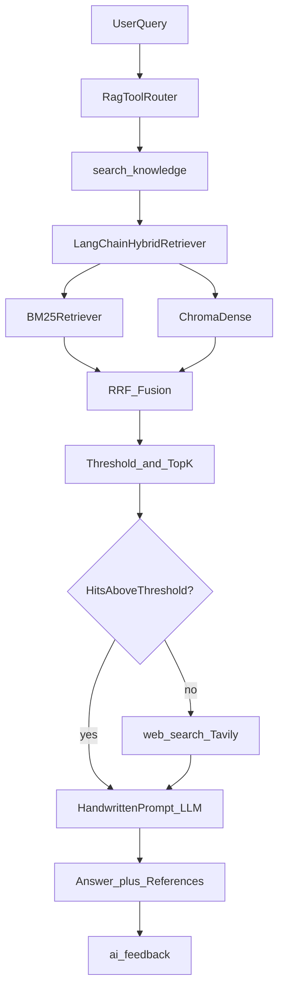

# Phase 3 · Wave D 需求与实施说明

> 更新日期：2026-09-09  
> 状态：**方案已定稿，业务代码未动** — 开发时切 Agent 模式，按序说「**开始 Wave D1**」…「**开始 Wave D6**」  
> 父文档：[`project-roadmap.md`](project-roadmap.md) §六、§八、§九  
> 关联：[`rag-eval.md`](rag-eval.md)、[`interview.md`](interview.md)、[`JD.md`](JD.md)

---

## 0. 怎么用本文档

| 你说 | Agent 应做 |
|------|------------|
| 「开始 Wave D1」 | 只实现 D1 范围；验收后写 dev-log，更新 roadmap 状态 |
| 「开始 Wave D2」 | 依赖 D1 完成；Tool + Tavily |
| 「开始 Wave D3」 | 反馈闭环 |
| 「开始 Wave D4」 | 上下文管理 |
| 「开始 Wave D5」 | Redis（可选） |
| 「开始 Wave D6」 | 文档/Golden Set/面试材料（可与 D1～D4 末尾合并） |

**门禁（与 roadmap 一致）：** 每 Wave 验收通过 → [`docs/dev-log/`](dev-log/) 一篇复盘 → 更新 [`project-roadmap.md`](project-roadmap.md) §9 状态 → 再开下一 Wave。

**开发前必读（前端）：** [`frontend-ai-brief.md`](frontend-ai-brief.md)、[`frontend-requirements.md`](frontend-requirements.md)

---

## 1. 背景与目标

### 1.1 现状缺口（简历/JD）

| 维度 | 现状 | JD 期望 |
|------|------|---------|
| RAG 检索 | Chroma 单向量 + top_k=3 | 混合检索、重排、调优 |
| Tool Use | 无 | 知识库优先 + 联网兜底（飞书式） |
| 框架 | 全手写 | 会用 LangChain 等（至少检索链） |
| 效果闭环 | 仅 `ai_call_log` | 用户反馈 + 评测 |
| 上下文 | Chat 有新建对话；生图附件无清理 | 可控上下文，避免污染生成 |

### 1.2 已定选型（2026-09-09）

- **LangChain：仅检索链**（BM25 + 向量 + RRF/阈值），**生成/Prompt/SSE 继续手写**
- **联网搜索：Tavily API**（`TAVILY_API_KEY`）
- **Tool 形态：规则 Router**（先 KB，弱/无命中再 `web_search`），非必须 LLM function calling
- **Redis：Wave D5 可选**（限流或 embedding 缓存）
- **HTTPS：Wave A 1-F**，与 Wave D 并行，不阻塞

### 1.3 升级后简历一句话

> 知识问答采用 LangChain 混合检索（BM25 + 向量 + RRF）+ 相似度阈值；本地无命中时 Tool 路由至 Tavily 联网搜索；RAG/Chat 支持用户反馈闭环；Chat/生图支持上下文清理。

---

## 2. 架构



### 2.1 分层原则（面试答法）

| 层 | 技术 | 原因 |
|----|------|------|
| 检索 | LangChain Retriever + BM25 + Chroma | JD 要框架；混合检索生态成熟 |
| 生成 | 手写 `rag_service` Prompt + SSE | citation、history 截断已稳定 |
| 编排 | Python `rag_router` 规则路由 | 单场景低延迟，比全量 LangGraph 合适 |

### 2.2 明确不做

- LangChain **整体替换** RAG/SSE 管线
- 完整 LangGraph 多 Agent 平台
- MCP Server（留 Phase 3+ C3 或后续 Wave）
- RAG 自动化 CI benchmark（Demo 级 Golden Set + 人工即可）
- OCR、Kafka、Nacos、Spring AI

---

## 3. Wave D1 — LangChain 混合检索 + 调优 v1

**预估：** 2～3 天  
**触发语：** 「开始 Wave D1」  
**dev-log：** `docs/dev-log/2026-09-rag-hybrid-retrieval.md`

### 3.1 目标

用 LangChain 实现 **retrieve 广 → filter/rerank 窄**，替换 `rag_service._retrieve_context` 内直接 `search_similar(top_k=3)` 的路径。

### 3.2 任务清单

| # | 任务 | 文件/位置 |
|---|------|-----------|
| D1-1 | 新建混合检索模块 | `ai-service-python/app/services/retrieval/langchain_retriever.py` |
| D1-2 | BM25 索引与 Chroma 同步（index/delete 钩子） | 同上 + `vector_store.py` 或 document index 路由 |
| D1-3 | 环境变量与默认值 | `.env.example`、`docker-compose` 注释 |
| D1-4 | 改造 `_retrieve_context` | `ai-service-python/app/services/rag_service.py` |
| D1-5 | references 增加 debug 字段 | `distance`, `retrieval_source`（dense/bm25/hybrid） |
| D1-6 | 依赖 | `requirements.txt`：`langchain`, `langchain-community`, `rank-bm25` |
| D1-7 | （可选 P1）标题/空行优先切分 | `text_splitter.py` |
| D1-8 | 更新参数文档 | `docs/rag-eval.md` §1 |
| D1-9 | Golden Set 草稿（10～15 题） | `docs/rag-eval.md` 新 § |

### 3.3 参数（env 可配）

| 变量 | 建议初值 | 说明 |
|------|----------|------|
| `RETRIEVE_CANDIDATES` | 20 | 第一阶段候选数 |
| `FINAL_TOP_K` | 3 | 进 Prompt 条数 |
| `DISTANCE_THRESHOLD` | 实测标定（如 1.2） | Chroma L2，弱相关过滤 |
| `RRF_K` | 60 | RRF 融合常数 |
| `BM25_WEIGHT` | 1.0 | 技术文档可调高 |
| `DENSE_WEIGHT` | 1.0 | 口语化问题可调高 |

**重排：** 首版用 **阈值 + RRF + top_k**（零额外 API）。加分项：Cohere Rerank 或本地 bge-reranker（单独 env 开关）。

### 3.4 验收标准

- [ ] T2/T5（[`rag-eval.md`](rag-eval.md)）：专有名词/ PDF 内容仍能命中
- [ ] 构造「错误码/产品型号」类问题：BM25 路径优于纯向量（对比 `retrieval_source`）
- [ ] 弱相关问题：threshold 过滤后 hits 为空或为 0 条（为 D2 联网做准备）
- [ ] 流式 SSE references 结构向后兼容（前端不崩）
- [ ] `rag-eval.md` 含 Golden Set 表（题号、期望文档、实际 hit@3）

### 3.5 不测 Tavily、不做 Tool Router（留给 D2）

---

## 3B. Wave D1.5 — RAG 质量优化与闭环（4～5 天）

> **状态：** ✅ 代码已交付（2026-09-09）· 验收需 **re-index 简历**  
> **触发语：** 「开始 Wave D1.5a」…「D1.5f」（已合并一次交付）  
> **dev-log：** [`dev-log/2026-09-rag-quality-d1_5.md`](dev-log/2026-09-rag-quality-d1_5.md)

| 子波 | 内容 | 状态 |
|------|------|------|
| D1.5a | top_k=6、列举 Prompt、RAG_TRACE | ✅ |
| D1.5b | split_text_structured + section metadata | ✅ |
| D1.5c | Query 改写 + multi-query | ✅ |
| D1.5d | BGE reranker local | ✅ |
| D1.5e | 同文档多 chunk / MMR-lite | ✅ |
| D1.5f | rag-eval / rag-badcases / 闭环文档 | ✅ |

**建议顺序：** D1 → **D1.5** → D3（反馈）→ D2（Tavily）→ D4 → D6

**验收：** G-Resume（两实习）· `RAG_TRACE=1` · 无关问题仍无法确定

---

## 4. Wave D2 — Tool Router + Tavily 联网兜底

**预估：** 2 天  
**依赖：** D1  
**触发语：** 「开始 Wave D2」  
**dev-log：** 合并进 `docs/dev-log/2026-09-rag-tool-feedback.md` 或单独 `2026-09-rag-tool-router.md`

### 4.1 目标

飞书式：**知识库优先**；无命中或全部超阈值 → **调用 Tavily**；对用户透明展示来源。

### 4.2 任务清单

| # | 任务 | 文件/位置 |
|---|------|-----------|
| D2-1 | Tool 注册表 | `ai-service-python/app/services/tools/registry.py` |
| D2-2 | `search_knowledge` | 封装 D1 检索链 |
| D2-3 | `web_search` | `tools/web_search_tavily.py`，`TAVILY_API_KEY` |
| D2-4 | 路由 | `ai-service-python/app/services/rag_router.py` |
| D2-5 | 接入 `rag_query` / `rag_query_stream` | `rag_service.py` |
| D2-6 | SSE 扩展 | `{"type":"tool","data":{"name":"web_search"}}` |
| D2-7 | references `source_type` | `knowledge` \| `web` |
| D2-8 | 前端来源样式 | `frontend/src/pages/KnowledgePage.tsx` |
| D2-9 | 无 Key 降级 | 仅 KB + 友好提示 |
| D2-10 | （P1）Chat「知识增强」开关 | `ChatPage.tsx` + Java 转发 RAG 流 |

### 4.3 路由伪代码

```
hits = search_knowledge(q)
if not hits or all(h.distance > THRESHOLD):
    web_hits = web_search(q)
    references = map_web_to_references(web_hits)
    prompt = build_web_prompt(q, references)  # 标注「来自网络」
else:
    references, prompt = build_kb_prompt(q, hits)
```

### 4.4 验收标准

- [ ] 库内有答案 → 仅 KB references，不调 Tavily（日志可证）
- [ ] 库外时事/常识 → Tavily references，`source_type=web`
- [ ] 前端：联网时显示「正在搜索…」或 tool 事件
- [ ] 无 `TAVILY_API_KEY`：不 500，降级文案合理
- [ ] 面试可演示：问库外问题有带来源回答

---

## 5. Wave D3 — AI 反馈闭环

**预估：** 1～2 天  
**依赖：** D2 可并行一半（仅 RAG UI 依赖 D2 references 结构）  
**触发语：** 「开始 Wave D3」

### 5.1 目标

Chat / RAG 点赞点踩；Admin 看分布；支撑「效果评估与持续优化」叙事（**非**伪在线学习）。

### 5.2 数据模型 `ai_feedback`

| 字段 | 类型 | 说明 |
|------|------|------|
| id | BIGINT PK | |
| user_id | BIGINT | |
| scene | VARCHAR | `rag` / `chat` / `image_gen` |
| ref_type | VARCHAR | `knowledge_turn` / `message` / `generation_job` |
| ref_id | BIGINT | |
| rating | VARCHAR | `up` / `down` |
| reason | VARCHAR | 点踩可选原因 |
| created_at | DATETIME | |

SQL：`docs/sql/ai_feedback.sql`

### 5.3 任务清单

| # | 任务 | 位置 |
|---|------|------|
| D3-1 | 建表 + 迁移说明 | `docs/sql/ai_feedback.sql` |
| D3-2 | Entity/Mapper/Service/Controller | `backend-java/.../AiFeedback*` |
| D3-3 | `POST /api/feedback` | 提交反馈 |
| D3-4 | `GET /api/admin/feedback/stats` | 分布 + 最近 down 列表 |
| D3-5 | RAG Turn 👍/👎 | `KnowledgePage.tsx` |
| D3-6 | Chat assistant 👍/👎 | `ChatPage.tsx` |
| D3-7 | （P2）生图 job 反馈 | Matting/Campaign 结果卡 |

**API 语义：** 同一 `(user_id, ref_type, ref_id)` **upsert** — 重复提交覆盖 rating/reason（见 `FeedbackController` 注释）。

### 5.4 验收标准

- [x] 同一 ref 重复提交：upsert（`uk_feedback_user_ref` + Service update）
- [x] Admin 页可见 up/down 比例与 RAG bad case 列表（`/admin/feedback`）
- [x] 点踩样本可手动记入 `rag-badcases.md`（reason 枚举已对齐）

### 5.5 面试叙事

- **在线：** 收集反馈 → 运营/开发看 bad case  
- **离线：** Golden Set + 点踩驱动 chunk/threshold 调参  
- **未来：** rerank 训练、知识库补文档

---

## 6. Wave D4 — 上下文管理

**预估：** 1 天  
**触发语：** 「开始 Wave D4」

### 6.1 Chat

| # | 任务 | 说明 |
|---|------|------|
| D4-1 | `POST /api/conversations/{id}/clear-context` | 插入边界标记或 `context_cleared_at`；`buildMessagesForLlm` 只取之后消息 |
| D4-2 | UI「清空上下文」 | `ChatPage.tsx` 顶栏/侧栏 |
| D4-3 | 文档 | 保留 `CONTEXT_MESSAGE_LIMIT=20`，说明 token 策略 |

**已有能力：** 「新建对话」= 新 session，不混历史。

### 6.2 生图 / 抠图 / Campaign

| # | 任务 | 说明 |
|---|------|------|
| D4-4 | `AiImageComposer` 清空按钮 | 清 attachments + 可选清 prompt |
| D4-5 | `SourceGenerateComposer` | 暴露 reset / 内置 clear |
| D4-6 | 审计隐式 reference | Matting/Campaign 页：请求**仅**带当前 composer，不自动带上轮 scheme |

### 6.3 RAG

| # | 任务 | 说明 |
|---|------|------|
| D4-7 | 「新会话」按钮显式化 | `KnowledgePage.tsx`（若 UX 已够用则仅文案） |
| D4-8 | （可选）显示「已带入 N 轮历史」 | history 500 字截断已有 |

### 6.4 验收标准

- [ ] Chat：清空后下一轮 LLM 请求不含清空前消息（抓包或日志）
- [ ] 生图：清空附件后请求 `referenceUrls` 为空
- [ ] 连续两次生图，第二次不受第一次 reference 影响（若无手动附加）

---

## 7. Wave D5 — Redis（可选）

**预估：** 1 天  
**触发语：** 「开始 Wave D5」  
**可与 D1～D4 并行或投递前补**

| # | 任务 | 说明 |
|---|------|------|
| D5-1 | `docker-compose` 加 `redis:7` | |
| D5-2 | Java `StringRedisTemplate` | |
| D5-3 | 限流 | `ratelimit:ai:{userId}:{scene}`，如 10 req/min |
| D5-4 | 或 embedding 缓存 | query hash → vector，TTL 5min |
| D5-5 | `architecture.md` Redis 小节 | |

**验收：** 超限返回 429 + 清晰文案；面试能讲 key 设计与 TTL。

---

## 8. Wave D6 — 评测与面试材料

**预估：** 0.5～1 天  
**触发语：** 「开始 Wave D6」  
**建议：** D1 完成后可开始填 Golden Set；D3 后补反馈 STAR

### 8.1 文档更新

| 文件 | 内容 |
|------|------|
| `rag-eval.md` | Golden Set、Recall@K 手工表、调参记录、web/kb 来源 case |
| `interview.md` | +2 STAR：Tool Router、反馈闭环 |
| `portfolio.md` | Phase 3 能力一句 + 截图（若有反馈 UI） |
| `project-roadmap.md` | §9 勾选 |
| `architecture.md` | D1/D2 检索与 Tool 图（可选 Mermaid） |

### 8.2 RAG 面试题 → 本项目答法（写入 interview.md）

| 面试题 | 答法要点 |
|--------|----------|
| 怎么调 chunk size？ | 400/50 默认；D1 标题切分；Golden Set 对比 hit@3 |
| 向量漏专有名词？ | BM25 + RRF；技术文档提高 BM25 权重 |
| 检索到但答错？ | 查 references；相关→改 Prompt；不相关→threshold/重排 |
| 怎么评估 RAG？ | Golden 15 题 + hit@k；`ai_feedback` online bad case |
| 幻觉怎么控？ | Prompt + 弱命中联网/明确无法确定 + 角标 |
| 延迟优化？ | retrieve 20→top 3；Redis embed cache；SSE 先推 references |
| 为什么 LangChain 不全用？ | 检索用框架；生成/SSE 手写可控 |
| Tool Use vs MCP？ | 函数注册表+规则路由；MCP 是标准化协议（后续 C3） |

---

## 9. 环境与 Secrets

| 变量 | Wave | 说明 |
|------|------|------|
| `TAVILY_API_KEY` | D2 | Tavily 搜索 |
| `RETRIEVE_CANDIDATES` 等 | D1 | 见 §3.3 |
| `TAVILY_API_KEY` 缺失 | D2 | 降级仅 KB |
| GitHub Secrets / ECS `.env` | D2 部署 | 演示机配置 |

---

## 10. 关键文件索引（实施时）

| 层级 | 文件 |
|------|------|
| Python 检索 | `retrieval/langchain_retriever.py`, `rag_service.py`, `vector_store.py`, `text_splitter.py` |
| Python Tool | `tools/registry.py`, `tools/web_search_tavily.py`, `rag_router.py` |
| Python 依赖 | `requirements.txt` |
| Java | `AiFeedback*`, `ConversationService`（clear-context） |
| SQL | `docs/sql/ai_feedback.sql` |
| 前端 | `KnowledgePage.tsx`, `ChatPage.tsx`, `AiImageComposer.tsx`, `SourceGenerateComposer.tsx` |

---

## 11. 风险

1. **Tavily 成本** — Demo 限流 + Key 仅 ECS  
2. **BM25/Chroma 不同步** — 必须在 index/delete 重建 BM25  
3. **DISTANCE_THRESHOLD** — 必须用真实文档标定，勿抄默认值  
4. **Chroma 全局 collection** — 面试主动说 tenant 隔离演进  
5. **2G ECS** — D1 本地验证后再 CD；避免一次上太多重依赖

---

## 12. 实施顺序总表

| 顺序 | Wave | 预估 | 状态 |
|------|------|------|------|
| 1 | D1 LangChain 混合检索 | 2～3d | ✅ |
| 1.5 | D1.5 RAG 质量闭环 | 4～5d | ✅ 待 re-index 手测 |
| 2 | D2 Tool + Tavily | 2d | ⬜ |
| 3 | D3 反馈闭环 | 1～2d | ✅ |
| 4 | D4 上下文管理 | 1d | ⬜ |
| 5 | D6 文档/面试 | 0.5～1d | ⬜ |
| 6 | D5 Redis（可选） | 1d | ⬜ |
| — | 1-F HTTPS | 0.5～1d | ⬜ |

**总预估：** 6～9 天（含 D5；不含 HTTPS）

---

*开发入口：Agent 模式下发送「**开始 Wave D1**」.*
