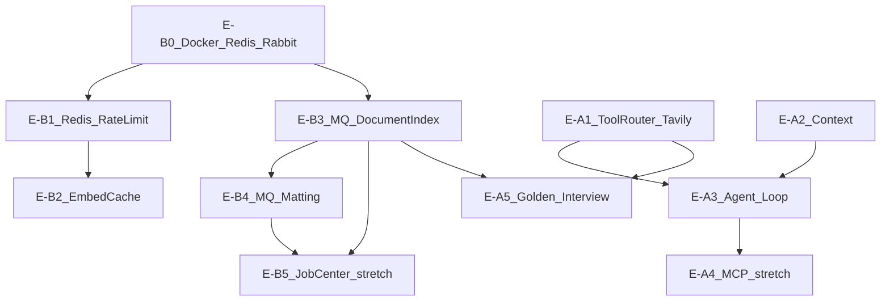

# Phase 4 · Wave E 迭代需求与个人学习路线

> 更新日期：2026-09-23  
> 定位：**项目 JD 缺口补齐** + **个人干中学**（对齐 [`java后端学习全链路.md`](java后端学习全链路.md) 阶段5、[`AI应用Agent开发岗位技能清单.md`](AI应用Agent开发岗位技能清单.md)）  
> 前置：[`phase3-wave-d-requirements.md`](phase3-wave-d-requirements.md)（Wave D 部分已完成，部分并入本文）  
> 总览表：[`project-roadmap.md`](project-roadmap.md) §六 Phase 4 / §九

---

## 0. 怎么用本文档

| 你说 | Agent 应做 |
|------|------------|
| 「开始 Wave E-B0」 | 仅 E-B0：Docker Redis/Rabbit + 环境说明 |
| 「开始 Wave E-B1」 | Redis AI 限流 |
| 「开始 Wave E-B3」 | MQ 知识库索引异步化（**推荐第一个 MQ 实现**） |
| 「开始 Wave E-A1」 | Tool Router + Tavily（原 Wave D2） |
| 「开始 Wave E-A2」 | 上下文管理（原 Wave D4 + token 预算） |
| 「开始 Wave E-A3」 | 手写 Agent Function Calling 小循环 |
| … | 每次 **只做一个模块**，验收 → dev-log → 更新 roadmap §9 |

**门禁：** 模块验收通过 → [`docs/dev-log/`](dev-log/) 一篇复盘 → 更新 [`project-roadmap.md`](project-roadmap.md) §9 → 再开下一模块。

**前端：** 遵守 [`frontend-ai-brief.md`](frontend-ai-brief.md)；构建验证 `pnpm -C frontend run build`。

**学习节奏：** 本文 **不设固定周历**；每个模块含「个人学习」小节，可按自己进度推进。

---

## 1. 原则

1. **中间件问题驱动**：Redis/MQ 必须对应真实痛点（见 §2），不为简历硬堆组件。
2. **仍可新增工作台功能**：AI 任务中心、Chat Agent 模式等，不限于改旧页面。
3. **明确不做**（与 [`architecture.md`](architecture.md) 一致）：
   - Nacos、Spring Cloud Gateway、Spring Cloud 全家桶
   - Kafka 全链路、Spring AI 替换 Python 层
   - LangChain **整体替换** RAG 生成/SSE
   - 完整 LangGraph 多 Agent 平台、RAG 自动化 CI benchmark
4. **生成/Prompt/SSE 继续手写**；LangChain 仍 **仅检索链**。

---

## 2. 问题驱动：为什么用 Redis / MQ

| 真实问题 | 现状 | 选型 | 落点 |
|----------|------|------|------|
| 知识库 **批量上传 / 全库 reindex** 耗时长，HTTP 易超时；进程重启 **丢内存任务** | 同步或 `CompletableFuture`（[`KnowledgeDocumentService.java`](../backend-java/src/main/java/com/workbench/backendjava/service/KnowledgeDocumentService.java)） | **MQ + Worker** + DB 任务表 | `async_job`；消费者调 Python index |
| 抠图 **extract** 长任务，4 线程池，重启丢任务 | [`MattingExtractService.java`](../backend-java/src/main/java/com/workbench/backendjava/service/MattingExtractService.java) | 同一 RabbitMQ，routing `ops.matting.extract` | API 返回 `jobId`，前端轮询 |
| AI 接口 **被刷**、成本失控 | 无限流 | **Redis** 滑动窗口/令牌桶 | `ratelimit:ai:{userId}:{scene}` |
| 同一 query **重复 embedding** | 每次 RAG 调 API | **Redis** query hash → vector，TTL 5～30min | [`embedding_service.py`](../ai-service-python/app/services/embedding_service.py) |
| 点踩自愈与主请求同 JVM | `@Async` [`RagFeedbackFixService`](../backend-java/src/main/java/com/workbench/backendjava/service/RagFeedbackFixService.java) | **P2** 可迁 MQ（重试/死信） | 非 Wave E 主线 |
| Chat 会话热数据（可选） | 全 MySQL | Redis 缓存 last-N 或摘要 | 与 E-A2 合并 |

**MQ 选型：** **RabbitMQ** 主线（对齐黑马路径 + JD「消息队列」）。附录对比 **Redis Streams**（何时不够用：持久消费组、死信、多消费者竞争）。**不引入 Kafka**。

---

## 3. Wave D 完成度对照（承接 phase3）

| Wave | 主题 | 状态 | Wave E 归属 |
|------|------|------|-------------|
| D1 / D1.5 / D1.8 | 混合检索、rerank、反馈信号、embed filename | ✅ | 已完成，勿重复 |
| D3 | AI 反馈闭环 + Admin 分页 | ✅ | 已完成 |
| **D2** | Tool Router + Tavily | ⬜ | **→ E-A1** |
| **D4** | 上下文管理 | ⬜ | **→ E-A2** |
| **D5** | Redis 限流/缓存 | ⬜ | **→ E-B1 / E-B2** |
| D6 | Golden Set + interview | 进行中 | **→ E-A5** |

### 3.1 已具备（面试可讲）

| 能力 | 证据 |
|------|------|
| RAG 全链路 + 混合检索/rerank/反馈 | [`rag-eval.md`](rag-eval.md)、[`langchain_retriever.py`](../ai-service-python/app/services/retrieval/langchain_retriever.py) |
| SSE Chat/RAG/Campaign | [`chat.ts`](../frontend/src/api/chat.ts)、[`rag_service.py`](../ai-service-python/app/services/rag_service.py) |
| 全局流式状态 | [`aiSessionStore.ts`](../frontend/src/stores/aiSessionStore.ts)、[`aiStreamRunner.ts`](../frontend/src/services/aiStreamRunner.ts) |
| Chat 多轮（粗） | [`ConversationService.buildMessagesForLlm`](../backend-java/src/main/java/com/workbench/backendjava/service/ConversationService.java) `CONTEXT_MESSAGE_LIMIT=20` |

### 3.2 仍缺（Wave E 目标）

| 维度 | 缺口 | 模块 |
|------|------|------|
| Java 中间件 | Redis、MQ 可靠性/幂等 | E-B0～E-B4 |
| AI 应用 | Tool 联网、上下文/token | E-A1、E-A2 |
| Agent | Function Calling 小循环、可选 MCP | E-A3、E-A4 |

---

## 4. 推荐实施顺序（依赖图）



**建议跟 Agent 的第一条指令链：** E-B0 → E-B3 → E-A1 → E-A2 → E-A3 →（E-B1/B4/A5 按需）。

---

## 5. Track B — 后端中间件

### Wave E-B0 — 中间件环境与学习打底

**解决什么问题**  
本地与 ECS 能一致启动 Redis/RabbitMQ；无中间件时项目仍可跑（兼容现有四服务 Compose）。

**个人学习**（[`java后端学习全链路.md`](java后端学习全链路.md) 阶段5）

- Redis：五结构、持久化 RDB/AOF 概念、击穿/穿透/雪崩（能口述即可）
- RabbitMQ：交换机/队列/绑定、ACK、幂等、死信队列
- 黑马 B 站关键词：`黑马 Redis`、`黑马 RabbitMQ`

**项目改动**

| # | 任务 | 说明 |
|---|------|------|
| B0-1 | `docker-compose.yml` 或 `docker-compose.middleware.yml` | `redis:7`、`rabbitmq:3-management` |
| B0-2 | Spring profile `middleware` | 无 Redis 时不启限流 Bean（可选） |
| B0-3 | [`deploy.md`](deploy.md) | 端口、密码、本机 IDE 连法 |
| B0-4 | `.env.example` | `REDIS_HOST`、`RABBITMQ_*` |

**验收标准**

- [ ] `docker compose up` 后 Redis/Rabbit 健康
- [ ] 不启中间件时 backend 仍能启动（文档写明条件）
- [ ] 能用 `redis-cli` / Rabbit 管理 UI 看到空实例

**面试 30 秒**  
「长任务和限流需要 Redis 和 MQ；我用 Compose 加 profile，Demo 默认可不启，生产启 full stack。」

**追问**

- Q：为什么不用 Kafka？→ 项目规模与运维成本；Rabbit 足够讲清异步解耦与可靠性。  
- Q：Redis 和 MQ 分工？→ Redis 热数据/限流/短缓存；MQ 持久化任务、削峰、重启可续消费。

**dev-log 建议：** `docs/dev-log/2026-09-wave-e-b0-middleware-docker.md`

---

### Wave E-B1 — Redis AI 限流

**解决什么问题**  
公网 Demo 上 AI 接口可被刷，Token 成本与后端压力不可控。

**个人学习**

- 技能清单 §五 缓存；黑马 Redis 分布式锁/限流思路（本项目用滑动窗口即可）

**项目改动**

| # | 任务 | 文件 |
|---|------|------|
| B1-1 | Spring Data Redis 依赖与配置 | `pom.xml`、`application.yml` |
| B1-2 | 限流拦截器/AOP | 新 `AiRateLimitInterceptor` 或 Filter |
| B1-3 | 覆盖路径 | `/api/chat/stream`、`/api/knowledge/query-stream`、生图相关 |
| B1-4 | 429 响应体 | 与 [`apiError.ts`](../frontend/src/utils/apiError.ts) kind 对齐 |

**Key 设计：** `ratelimit:ai:{userId}:{scene}`，如 10 req/min（env 可配）。

**验收标准**

- [ ] 同一用户超限 → 429 + 中文提示
- [ ] 未配置 Redis 时降级（放行或内存限流，文档二选一写死）

**面试 30 秒**  
「AI 流式接口按 userId+scene 在 Redis 做滑动窗口限流，超限 429，key 带 TTL 自动过期。」

**dev-log 建议：** `docs/dev-log/2026-09-wave-e-b1-redis-ratelimit.md`

---

### Wave E-B2 — Redis Embedding / 检索热点缓存

**解决什么问题**  
同一问题重复问，重复调 embedding API，浪费钱与延迟。

**个人学习**

- 技能清单 §三 Embedding；缓存一致性：TTL 即可，无需与 Chroma 强一致

**项目改动**

| # | 任务 | 文件 |
|---|------|------|
| B2-1 | Key：`embed:q:{sha256(normalized_query)}` | Python 或 Java |
| B2-2 | TTL 5～30min（env） | |
| B2-3 | 文档 | [`rag-eval.md`](rag-eval.md) §缓存 |

**验收标准**

- [ ] 同一 query 第二次检索日志/trace 表明 cache hit
- [ ] 文档索引更新后 cache 自然 TTL 过期（不要求主动失效）

**dev-log 建议：** 可合并进 B1 dev-log

---

### Wave E-B3 — MQ 知识库索引异步化（第一个 MQ 故事）

**解决什么问题**  
上传/全库 reindex 阻塞 HTTP；`runAsync` 进程重启丢任务；前端长时间 loading。

**个人学习**

- 技能清单 §五 消息队列；黑马 MQ：异步解耦、可靠性、**消费幂等**
- 对照 [`java后端学习全链路.md`](java后端学习全链路.md) 阶段5 MQ 章节

**项目改动**

| # | 任务 | 说明 |
|---|------|------|
| B3-1 | 表 `async_job` | `id, user_id, type, status, payload_json, error, created_at, updated_at` |
| B3-2 | type 枚举 | `document_index`, `reindex`, `reindex_all` |
| B3-3 | 生产者 | 上传成功 → insert job pending → publish Rabbit |
| B3-4 | 消费者 | `@RabbitListener` → 调 `PythonAiClient.indexDocument` / reindex |
| B3-5 | API | `GET /api/knowledge/jobs/{id}` 查询状态 |
| B3-6 | 前端 | [`KnowledgeDocumentListPage.tsx`](../frontend/src/pages/KnowledgeDocumentListPage.tsx) 索引中状态 + 轮询 |
| B3-7 | 幂等 | 同一 `document_id` 重复消息：以最新 job 或 version 字段去重 |

**Rabbit 建议拓扑**

- Exchange：`workbench.tasks`（direct）
- Queue：`knowledge.index`
- Routing key：`knowledge.index`

**验收标准**

- [ ] 上传大 PDF 立即返回，UI 显示 indexing → done/failed
- [ ] 重启 backend 后：未 ACK 消息重新消费或 job 标 failed（策略写进文档）
- [ ] 重复投递不会重复写坏数据（幂等）
- [ ] Admin reindex-all 走同一套 job（可选 P1）

**面试 30 秒**  
「索引从 HTTP 线程拆到 RabbitMQ：上传写 MySQL 和 async_job，发消息，Worker 调 Python index；前端轮询 job 状态，重启不丢任务。」

**追问**

- Q：如何保证不丢消息？→ 持久化队列 + 手动 ACK + 消费成功再 ACK。  
- Q：重复消费怎么办？→ document_id 幂等 + job status 状态机。

**dev-log 建议：** `docs/dev-log/2026-09-wave-e-b3-mq-knowledge-index.md`

---

### Wave E-B4 — MQ 抠图 extract 任务化

**解决什么问题**  
[`MattingExtractService`](../backend-java/src/main/java/com/workbench/backendjava/service/MattingExtractService.java) 内存线程池 4 线程，与 B3 同类「长任务脱离 HTTP」。

**项目改动**

| # | 任务 | 说明 |
|---|------|------|
| B4-1 | Queue `ops.matting.extract` | 复用同一 Exchange |
| B4-2 | confirmExtract → 发 job | 保留 `config_json` 状态机 |
| B4-3 | Worker 内调现有 `doExtract` 逻辑 | 尽量少改业务 |
| B4-4 | 前端 | [`MattingPage.tsx`](../frontend/src/pages/MattingPage.tsx) 轮询可复用 |

**验收标准**

- [ ] 多元素 extract 行为与现网一致
- [ ] 服务重启后任务可恢复或明确 failed

**dev-log 建议：** `docs/dev-log/2026-09-wave-e-b4-mq-matting-extract.md`

---

### Wave E-B5 — AI 任务中心（Stretch）

**解决什么问题**  
用户/admin 统一查看 indexing、extract、reindex 进度。

**项目改动**

- 新页 `/ops/jobs` 或 Settings 子 Tab
- 聚合 `async_job` + 现有 matting task status

**依赖：** E-B3、E-B4

**验收：** 列表筛选 type/status；点击跳转对应文档/抠图任务

---

## 6. Track A — AI 应用 / Agent

### Wave E-A1 — 规则 Tool Router + Tavily（原 Wave D2）

**解决什么问题**  
知识库无答案时只能「没有文档」；JD 要求 Tool/联网兜底。

**个人学习**

- [`AI应用Agent开发岗位技能清单.md`](AI应用Agent开发岗位技能清单.md) §三 RAG、§五 服务化
- 理解 **规则路由 vs LLM 选工具**（A1 做规则，A3 做 function call）

**项目改动**（自 phase3 §4 迁移）

| # | 任务 | 文件 |
|---|------|------|
| A1-1 | Tool 注册表 | `ai-service-python/app/services/tools/registry.py` |
| A1-2 | `search_knowledge` | 封装 hybrid_search |
| A1-3 | `web_search` | `tools/web_search_tavily.py`，`TAVILY_API_KEY` |
| A1-4 | 路由 | `rag_router.py` |
| A1-5 | 接入 `rag_query_stream` | `rag_service.py` |
| A1-6 | SSE `type: tool` | 前端 Knowledge 显示「正在搜索…」 |
| A1-7 | references `source_type` | `knowledge` \| `web` |
| A1-8 | 无 Key 降级 | 仅 KB + 友好提示 |

**路由逻辑（伪代码）**

```
hits = search_knowledge(q)
if not hits or weak_hit:
    web_hits = web_search(q)
    references = map_web(...)
    prompt = build_web_prompt(...)  # 标注来自网络
else:
    references, prompt = build_kb_prompt(...)
```

**验收标准**

- [ ] 库内有答案 → 不调 Tavily（日志可证）
- [ ] 库外问题 → web references + 带来源回答
- [ ] 无 `TAVILY_API_KEY` 不 500

**面试 30 秒**  
「RAG 先 hybrid 检索，弱命中或无命中走 Tavily；SSE 推 tool 事件，references 区分 knowledge/web。」

**dev-log 建议：** `docs/dev-log/2026-09-wave-e-a1-tavily-router.md`

---

### Wave E-A2 — 上下文管理（原 Wave D4 + 加深）

**解决什么问题**  
Chat 仅「最近 20 条」无清空边界；无 token 感知；生图附件可能污染下一轮；RAG history 用户不可见。

**个人学习**

- 技能清单 §二 上下文窗口、§四 短期记忆
- Token 估算：中文可粗算 `len/1.5` 或 tiktoken 可选

**项目改动**

**Chat**

| # | 任务 | 说明 |
|---|------|------|
| A2-1 | `POST /api/conversations/{id}/clear-context` | `context_cleared_at` 或边界 message |
| A2-2 | `buildMessagesForLlm` | 只取清空点之后 |
| A2-3 | Token 预算 P0 | 超限时 **截断最旧** messages（保留 system 规则若有） |
| A2-4 | Token 预算 P1 | 可选 LLM 摘要压缩旧对话 |
| A2-5 | UI | [`ChatPage.tsx`](../frontend/src/pages/ChatPage.tsx)「清空上下文」「约 N 轮」 |

**RAG**

| # | 任务 | 说明 |
|---|------|------|
| A2-6 | 新会话显式化 | [`KnowledgePage.tsx`](../frontend/src/pages/KnowledgePage.tsx) |
| A2-7 | 可选展示「已带入 N 轮历史」 | |

**生图 / Campaign**

| # | 任务 | 说明 |
|---|------|------|
| A2-8 | [`AiImageComposer`](../frontend/src/components/ai/AiImageComposer.tsx) 清空附件 | |
| A2-9 | Matting/Campaign 审计隐式 reference | 请求仅当前 composer |

**Redis 可选（P1）**  
Session 摘要缓存，与 E-B2 分开 key 空间。

**验收标准**

- [ ] Chat 清空后下一轮请求不含清空前消息（日志/抓包）
- [ ] 生图清空后 `referenceUrls` 为空
- [ ] 文档说明 `CONTEXT_MESSAGE_LIMIT` 与 token 策略

**面试 30 秒**  
「多轮 Chat 有清空边界和条数/token 上限；RAG 检索仍用当前问句，生成才拼 history，避免污染召回。」

**dev-log 建议：** `docs/dev-log/2026-09-wave-e-a2-context-management.md`

---

### Wave E-A3 — 手写简易 Agent（Function Calling 小循环）

**解决什么问题**  
JD Agent 岗要求 **工具调用**；仅规则路由（A1）不足以讲「模型自主选工具」。

**个人学习**

- 技能清单 §四：**手写简易 Agent 比只套 LangChain 加分**
- ReAct 思想口述即可；实现 **max_steps=3** 的工具循环

**范围控制（写死）**

- 新目录 `ai-service-python/app/services/agent/`
- 函数 `run_tool_loop(messages, tools, max_steps=3)`
- 工具 2～3 个：
  - `search_knowledge`（hybrid）
  - `web_search`（Tavily）
  - （可选）`list_recent_documents`（调 Java 内网 API）
- 使用 DeepSeek/OpenAI 兼容 **tools** 参数，**不用 LangGraph**

**入口（P0 二选一）**

- **P0-A** Chat 页「Agent 模式」开关，独立 SSE 或复用 chat stream 扩展事件
- **P0-B** 知识库「智能助手」Tab

**SSE 事件**

- `tool_call`（name + args）
- `tool_result`（摘要）
- `message`（最终回答）

**前端**

- 展示工具调用时间线（类似 references 面板）

**验收标准**

- [ ] 需查库时调用 search_knowledge；需联网时调用 web_search
- [ ] 超过 max_steps  graceful 结束
- [ ] 面试可演示 1 个多步场景（如「先查库没有再联网」）

**面试 30 秒**  
「Python 手写 tools 循环：LLM 返回 tool_calls → 执行注册工具 → 结果塞回 messages，最多 3 步，SSE 暴露 tool_call/result。」

**追问**

- Q：和 A1 规则路由区别？→ A1 固定 if/else；A3 模型决定调用哪个 tool（仍限制工具集）。  
- Q：怎么防幻觉工具参数？→ pydantic 校验 + 工具内再鉴权。

**dev-log 建议：** `docs/dev-log/2026-09-wave-e-a3-agent-tool-loop.md`

---

### Wave E-A4 — MCP 最小 Server（Stretch）

**解决什么问题**  
新 JD 出现 MCP；字节 Agent 向加分。

**项目改动**

- 独立小进程或 Python 路由，暴露 `search_knowledge` 为 MCP tool
- 不阻塞 A1～A3

**个人学习**  
技能清单 §四 MCP；官方 MCP 文档浏览即可

**dev-log 建议：** `docs/dev-log/2026-09-wave-e-a4-mcp-server.md`

---

### Wave E-A5 — 评测与面试材料（吸收 Wave D6）

**项目改动**

| 文件 | 内容 |
|------|------|
| [`rag-eval.md`](rag-eval.md) | Golden 填完；web/kb 来源 case；MQ job case |
| [`interview.md`](interview.md) | +STAR：MQ 索引、Redis 限流、Agent 工具循环、Tavily |
| [`resume-project.md`](resume-project.md) | 诚实档位随模块验收升级 |

**验收**

- [ ] 每条 Wave E 模块至少 1 条可背 STAR
- [ ] Golden G-Resume 等部署后手测通过

---

## 7. Track F — 产品功能打包

| 功能 | 依赖模块 | 用户价值 |
|------|----------|----------|
| **AI 任务中心** | E-B3、E-B4、E-B5 | 看得见 indexing/extract 进度 |
| **联网问答标识** | E-A1 | Knowledge 页 web 来源样式 |
| **Chat Agent 模式** | E-A3 | 演示工具调用链 |
| **上下文控制条** | E-A2 | Chat 记忆可控 |

---

## 8. JD / 简历 / 面试映射

| JD 关键词 | Wave E 模块 | 简历写法（验收后） |
|-----------|-------------|-------------------|
| Redis | E-B1、E-B2 | AI 接口 Redis 限流；embedding 查询缓存 |
| 消息队列 | E-B3、E-B4 | RabbitMQ 异步文档索引/抠图 extract，async_job 状态可查 |
| RAG | 已有 + E-A1 | 本地混合检索 + Tavily 兜底 |
| Tool / Function Call | E-A1、E-A3 | 规则路由 + 手写 tools 循环（SSE 可观测） |
| 上下文 / 记忆 | E-A2 | 清空边界、token 截断、RAG 会话显式化 |
| MCP | E-A4 | 可选 stretch |

**投递节奏更新（在 Wave E 部分完成后）**

- **AI 应用开发岗**：E-B3 + E-A1 + E-A2 + 现有 RAG
- **Agent 岗**：上述 + **E-A3**（必做）+ E-A4 可选

---

## 9. 附录 A — 学习资源索引

| 本项目模块 | java后端学习全链路 | Agent 技能清单 |
|------------|-------------------|----------------|
| E-B0～B1 | 阶段5 Redis | §五 缓存 |
| E-B3～B4 | 阶段5 MQ | §五 MQ 长任务 |
| E-A1 | — | §三 RAG、§五 服务化 |
| E-A2 | — | §二 上下文、§四 记忆 |
| E-A3 | — | §四 Function Call、Agent 框架对比 |
| E-A4 | — | §四 MCP |

**黑马 B 站搜索：** 见 [`java后端学习全链路.md`](java后端学习全链路.md) 文末关键词列表。

---

## 10. 附录 B — Redis Streams vs RabbitMQ（阅读用）

| 维度 | Redis Streams | RabbitMQ |
|------|---------------|----------|
| 典型场景 | 轻量队列、已有 Redis | 任务队列、死信、路由灵活 |
| 持久与 ACK | 支持 consumer group | 成熟 ACK/NACK |
| 本项目 | E-B1/B2 缓存与限流 | E-B3/B4 **任务** |

---

## 11. 维护清单（文档完成后同步）

- [x] 新建本文档
- [x] [`project-roadmap.md`](project-roadmap.md) §六点五 Phase 4、§九 Wave E 行
- [x] [`resume-project.md`](resume-project.md) §诚实档位说明 Wave E 模块
- [x] [`study-plan.md`](study-plan.md) Wave E 入口链接
- [ ] [`architecture.md`](architecture.md) Redis/Rabbit/async_job（随 E-B0/B3 实施补）

---

## 12. Wave D 遗留任务清单速查（迁移自 phase3）

### D2 → E-A1（见 §6）

### D4 → E-A2（见 §6）

### D5 → E-B1 + E-B2（见 §5）

### D6 → E-A5（见 §6）
