# AI Creative Workbench — 作品说明

> 投递用一页纸：陌生人 5 分钟内能看懂「解决什么、你怎么做的、效果如何」。  
> **Demo：** http://8.148.238.164:8088

---

## ① 解决的问题

游戏 / 内容团队日常有两类痛点：

1. **素材分散**：原画、活动图、抠图结果散落在本地和 IM，缺少统一标签、检索与批量管理。
2. **知识难用**：规范文档、策划案、简历/说明多为 PDF/DOCX，无法直接给 AI 问答；通用 Chat 又容易「幻觉」。

本项目是一个 **AI 创意素材 + 知识工作台**：把「管素材」和「问知识库」放在同一套产品里，并用 **可部署、可演示** 的全栈架构落地（非纯前端 Demo）。

---

## ② 个人贡献

本项目为 **独立全栈交付**（前端 → Java BFF → Python AI → Docker/CD）：

| 领域 | 具体工作 |
|------|----------|
| **前端** | Studio Neutral 设计体系；Chat SSE + 虚拟列表双模式；路由 lazy load；统一 API 错误；知识库 / 素材 / Campaign 业务页 |
| **Java** | JWT 鉴权、素材与知识库 CRUD、文件上传、SSE 转发、AI 调用日志（`ai_call_log`）、Python 客户端封装 |
| **Python** | FastAPI；混合 RAG（语义 chunk → embed → Chroma → hybrid+rerank → LLM）；PDF/DOCX 解析；反馈分诊与自愈 |
| **工程化** | Docker 四服务 compose；GitHub Actions CI + CD（GHCR → 阿里云 ECS）；2G 轻量机性能与部署踩坑复盘 |

**简历正文（可直接复制）：** [`resume-project.md`](resume-project.md)  
STAR / JD 对齐见 [`interview.md`](interview.md)、[`.cursor/skills/resume-project-expert/`](../.cursor/skills/resume-project-expert/SKILL.md)。

---

## ③ AI 方案

### 3.1 架构：Java 编排 + Python 能力层

- 前端 **只调 Java**，不直连 Python（统一鉴权与错误模型）。
- Python 专注 **模型、向量、文档解析**；业务状态与文件在 Java + MySQL。

### 3.2 RAG 流水线（生成/Prompt/SSE 手写；LangChain 仅检索链）

```
入库     → parse（md/txt/pdf/docx）
         → semantic_chunk + AI 打标
         → build_embed_text(文档:filename 小节:heading 摘要:summary + content) → embed
         → Chroma（documents=纯 content；metadata: section/heading/tags/...）
问答     → Query 改写 + multi-query hybrid（dense+BM25+tag+RRF, 30 候选）
         → BGE rerank → select_context(top 6) → Prompt（列举穷尽）→ 流式 LLM + references
反馈     → 👍/👎 → 分诊 Agent → penalize/boost/reindex → Admin 可撤销信号 / 全库 re-index
```

**格式支持：** `.md` / `.txt` / `.pdf` / `.docx`  
**边界：** 无 OCR（扫描版 PDF / 纯图片 DOCX 明确报错）；二进制文档只读预览、更新需重传。  
**embedding 升级：** 旧文档需 Admin「重建全库向量」一次后 filename 才进入 dense 向量。

### 3.3 Chat 与其它 AI 能力

- **SSE 流式**：Java 转发 Python `message` / `usage` / `done` 事件；前端打字机 + token 用量展示。
- **多模态 Chat**：参考图经 Java 转 Python，走 OpenAI 兼容多模态格式。
- **Campaign / 抠图**：工作流式 UI + AI 方案生成（非通用 Agent，但可讲 Tool 扩展思路）。

详见 [`architecture.md`](architecture.md)、[`rag-eval.md`](rag-eval.md)。

---

## ④ 验证结果

| 验收项 | 结果 |
|--------|------|
| 公网 Demo 可登录 | http://8.148.238.164:8088 ✅ |
| GitHub Actions CD 部署 ECS | push → workflow_dispatch → 三镜像 GHCR → compose up ✅ |
| 知识库 md/txt/pdf/docx 入库 | chunk_count > 0，问答 references 含文件名 ✅ |
| 文本框版 DOCX 简历 | docx2txt 提取 ~7000 字，RAG 可引用 ✅ |
| Chat 长会话 | 虚拟列表 + 流式双模式，布局不重叠 ✅ |
| 素材页 2G ECS | N+1 优化 + 懒加载，刷新稳定 ✅ |
| RAG 混合检索 + rerank | 30 候选 → BGE → top 6，trace 可诊断 ✅ |
| AI 反馈闭环 | 👍👎 持久化 + Admin 统计 + 文档信号撤销 ✅ |
| Admin 全库 re-index | embedding 含 filename 后一键重建 ✅ |

**建议现场演示路径（约 3 分钟）：**

1. 登录 → 知识库上传 PDF 或 DOCX → 打开只读预览  
2. 知识库问答 → 展示 references 角标  
3. Chat 流式提问（可选附图）  
4. 素材 Grid 滚动 / 标签筛选  

---

## ⑤ 一次关键迭代：Wave B PDF/DOCX RAG

**背景：** RAG 仅支持 md/txt，Java 已能把二进制传到 Python，瓶颈在 Python 侧 `UTF-8` 硬解码。

**做法：**

1. 新建 `binary_document_extractor.py`，按后缀插件化（pypdf / docx2txt）。
2. 下游 chunk/embed/Chroma **零改动**——统一 plain text 流水线。
3. Java `getContent` 调 Python `/parse` 做预览；前端 PDF/DOCX 只读 + 提取文本展示。
4. **补丁：** 排版型 DOCX（文本框）python-docx 读不到 → 换 **docx2txt**，覆盖页眉/页脚/文本框。

**结果：** 本地 + ECS 全链路验收；面试可讲「解析层插件化 + 明确边界（无 OCR）」。

复盘全文：[`dev-log/2026-09-rag-pdf-docx.md`](dev-log/2026-09-rag-pdf-docx.md)

---

## 产品截图导览

### 登录

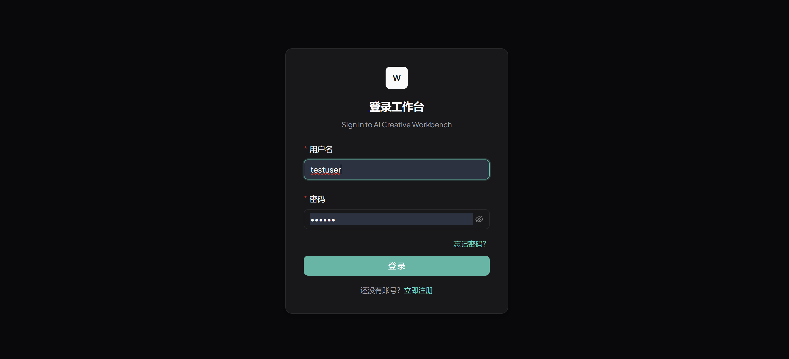

**路由：** `/login`  
**可做什么：** 登录进入工作台；新用户注册；找回密码。

---

### 素材库（Grid）


**路由：** `/assets`  
**可做什么：** Grid/List 切换；关键词搜索；按标签筛选；查看统计条；编辑素材名与标签；批量删除；跳转上传页。

---

### 上传素材

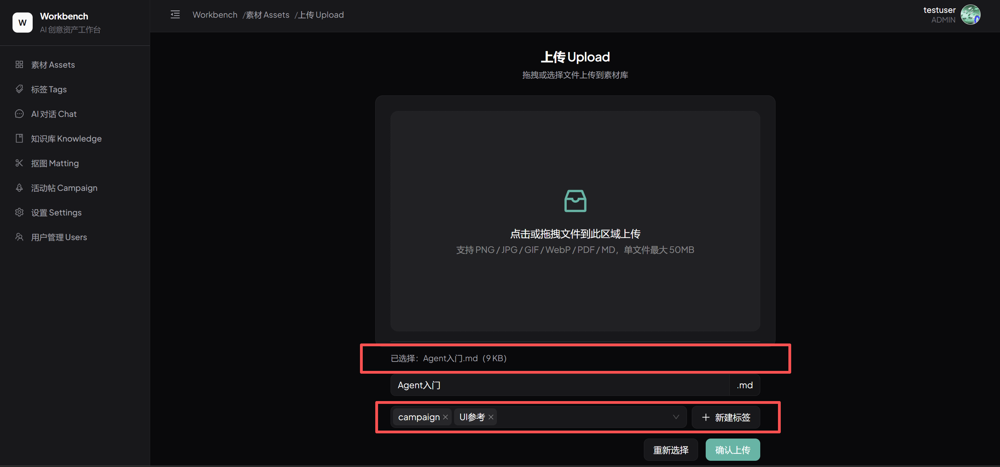

**路由：** `/assets/upload`  
**可做什么：** 拖拽或选择图片；修改文件名；选择/新建标签；上传写入素材库。

---

### 标签管理

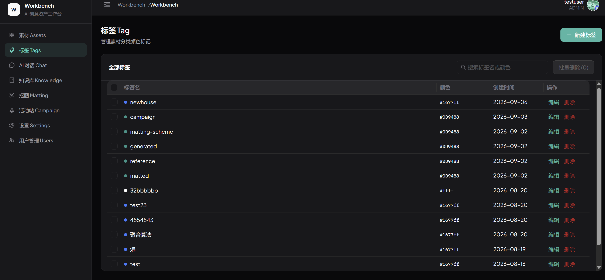

**路由：** `/tags`  
**可做什么：** 维护标签名称与颜色；查看关联素材数；搜索；批量删除（素材侧解除关联）。

---

### AI 对话（流式）


**路由：** `/chat`  
**可做什么：** 新建/切换/重命名会话；多轮对话；流式打字机输出；可选参考图多模态提问。

---

### 知识库问答（RAG）


**路由：** `/knowledge`  
**可做什么：** 针对已索引文档提问；流式回答带 `[1][2]` 角标；查看 references 文件名与片段；管理问答会话。

---

### 文档库


**路由：** `/knowledge/documents`  
**可做什么：** 分页搜索排序；上传文档并自动 index；查看 chunk_count；编辑描述；删除；进入编辑器。

---

### 文档编辑（Markdown）

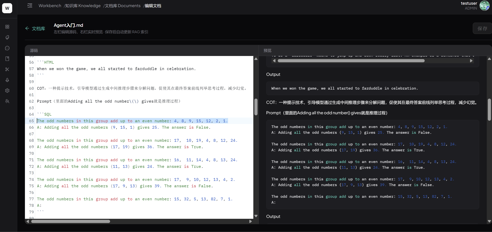

**路由：** `/knowledge/documents/:id`（md/txt）  
**可做什么：** 双栏编辑；保存并触发 re-index；未保存提示。

---

### 文档预览（PDF/DOCX）

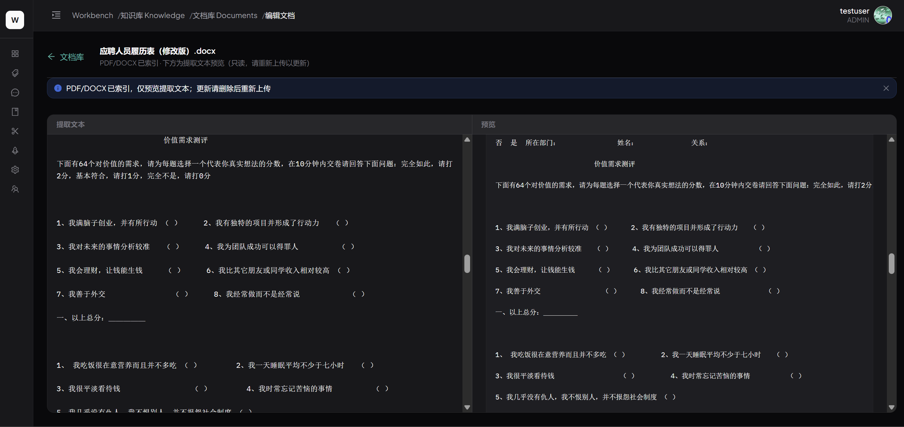

**路由：** `/knowledge/documents/:id`（pdf/docx）  
**可做什么：** 查看提取文本与预览；关闭只读提示；更新需删除后重新上传。

---

### 抠图工作台 Matting

**路由：** `/ops/matting` · 工作流：**源图 → 框选 → 元素 → 候选 → 保存**（5 步）

#### 步骤 1 · 源图

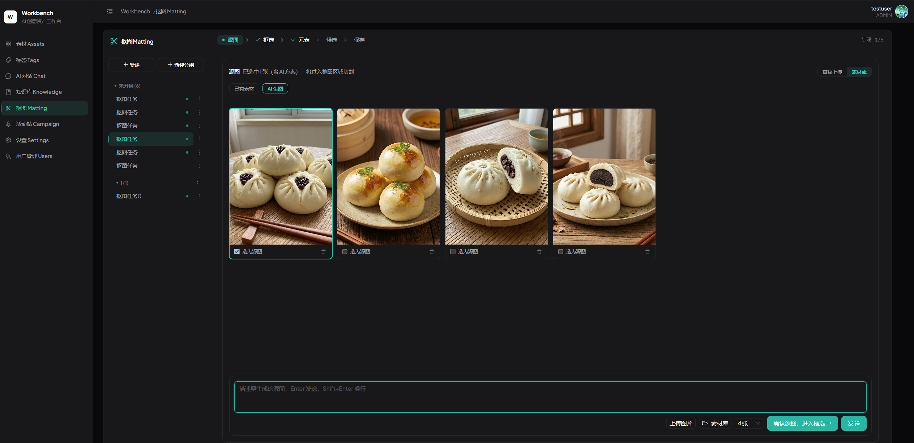

**可做什么：** 选源图；预览；确认后进入框选。

#### 步骤 2 · 框选

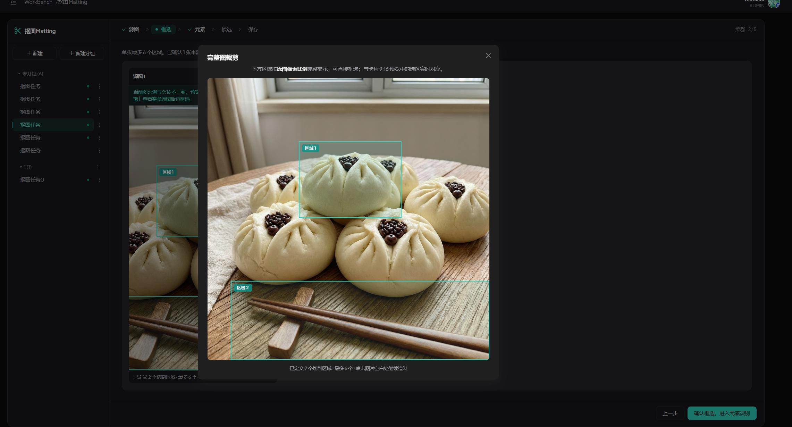

**可做什么：** 调整裁切框；确认后 AI 识别元素层。

#### 步骤 3 · 元素

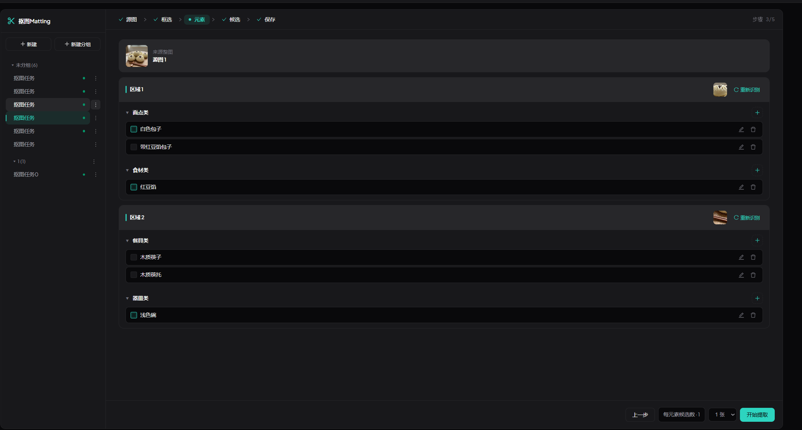

**可做什么：** 勾选参与提取的元素；重新识别区域；添加自定义元素。

#### 步骤 4 · 候选

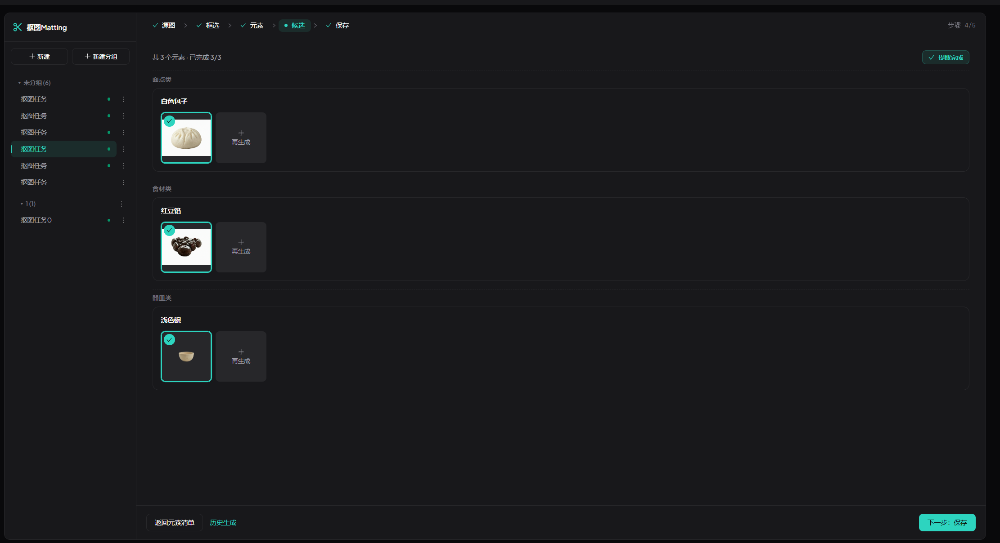

**可做什么：** 为每个元素挑选最佳候选；失败单元素重试。

#### 步骤 5 · 保存

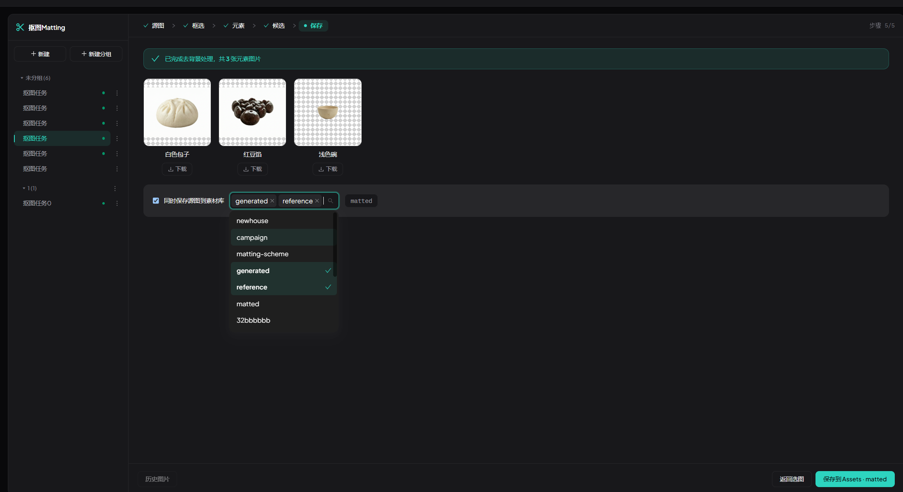

**可做什么：** 预览成品；命名打标签；保存到 Assets（matted）。

---

### 活动帖 Campaign

**路由：** `/ops/campaign` · 工作流：**活动信息 → 配图 Tab → 文案 Tab → 预览 Tab**

#### 草稿侧栏 + 活动信息

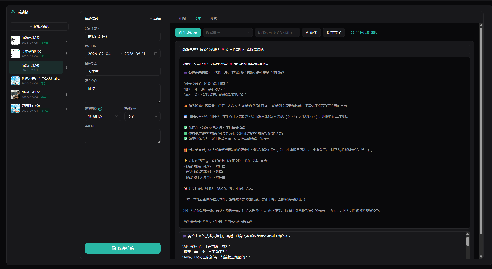

**可做什么：** 新建/切换/重命名草稿；填写主题、时间、受众、福利、视觉风格；保存草稿。

#### Tab · 配图

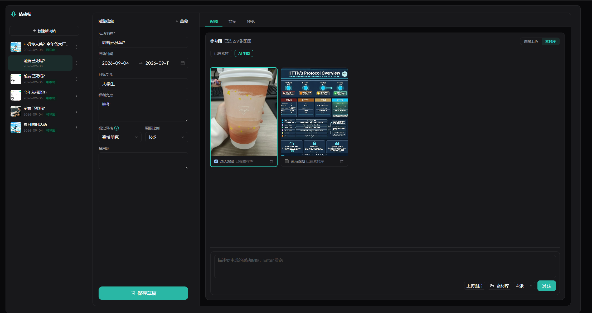

**可做什么：** 选图组成活动配图；与抠图同源选图器体验。

#### Tab · 文案（生成中）

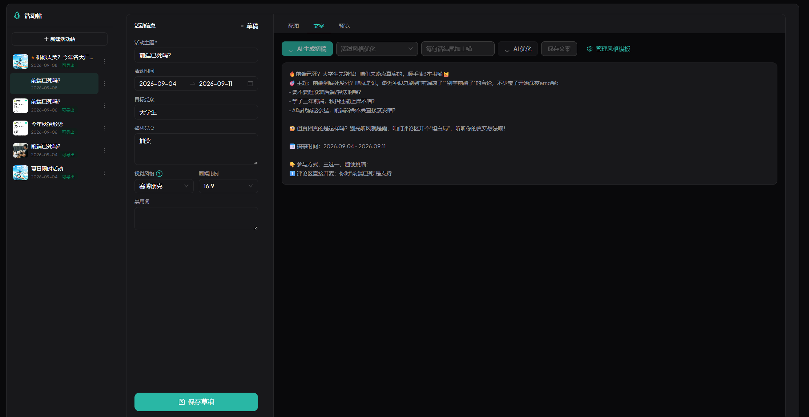

**可做什么：** AI 生成初稿 / 优化；选 Prompt 模板；流式输出过程。

#### Tab · 文案（完成）

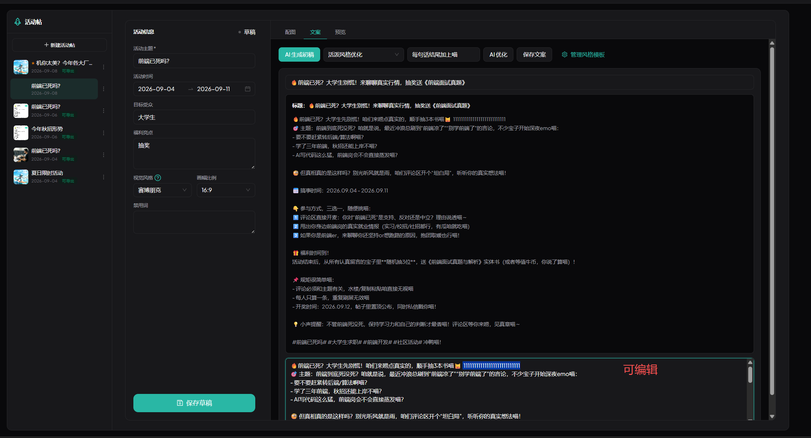

**可做什么：** 编辑标题与正文；保存文案；管理风格模板。

#### Tab · 预览（整页）

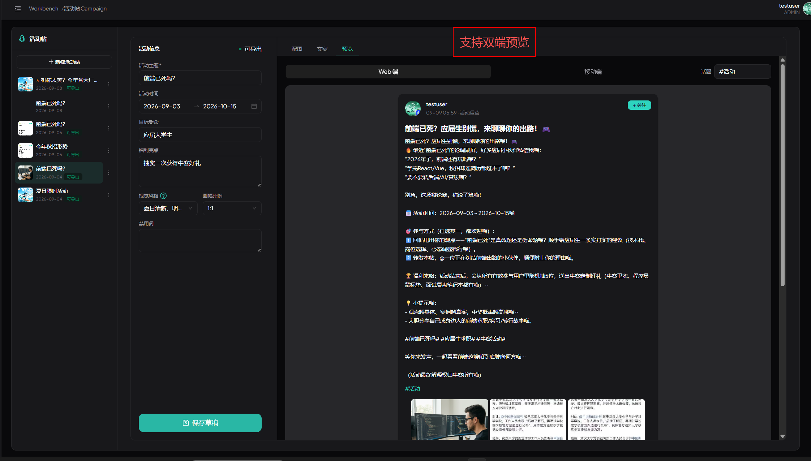

**可做什么：** 预览发帖效果；编辑 hashtag；保存完整活动帖；导出。

#### Tab · 预览（九宫格）

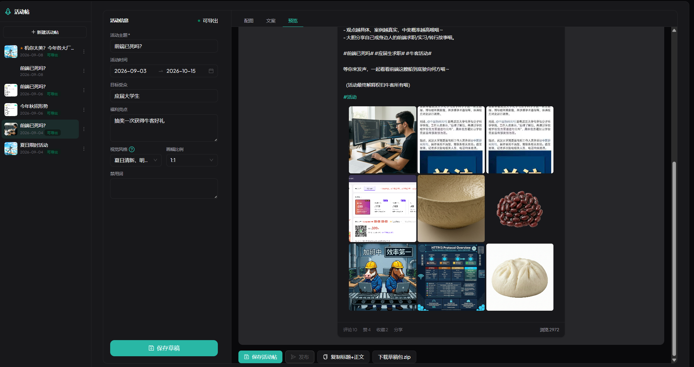

**可做什么：** 查看已选配图在九宫格中的排列；配合标题/正文展示最终发帖样式。

---

### 设置 Settings

**路由：** `/settings` · 三个 Tab：**账户 | 外观 | Prompt 模板**

#### Tab · 账户

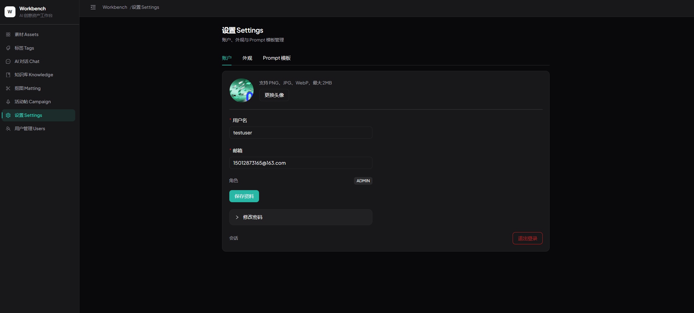

**可做什么：** 更换头像；修改用户名/邮箱；查看角色；折叠面板改密码；退出登录。

#### Tab · 外观

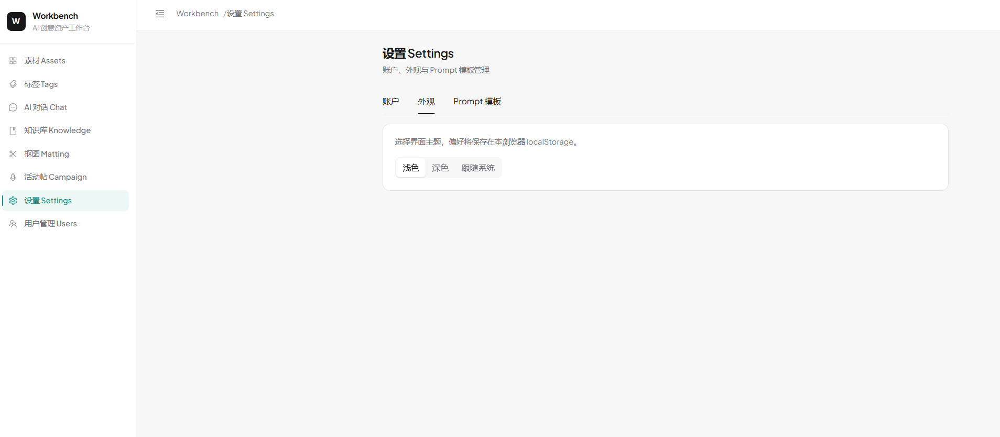

**可做什么：** 切换界面主题；偏好保存在浏览器 localStorage。

#### Tab · Prompt 模板

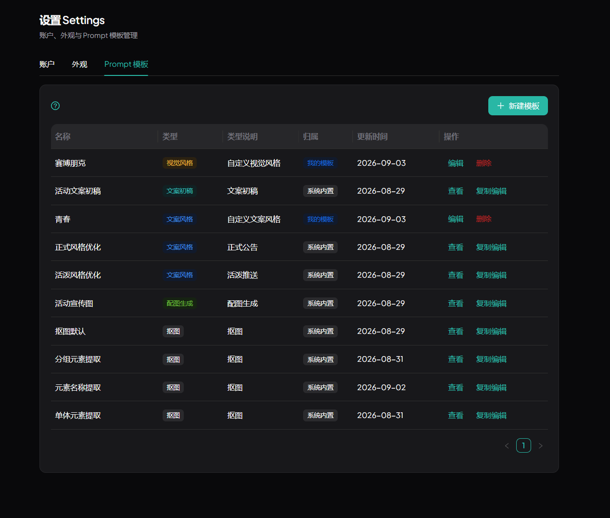

**可做什么：** 增删改 Prompt 模板；Campaign 文案生成时选择风格模板。

---

### 用户管理 Admin

**路由：** `/admin/users`（仅 **ADMIN** 角色可见侧边栏入口）

#### 用户列表

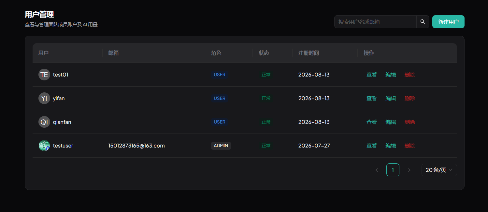

**可做什么：** 分页浏览团队成员；按用户名/邮箱搜索；新建用户；编辑角色/状态/密码；禁用账号。

#### 查看 · 基本信息

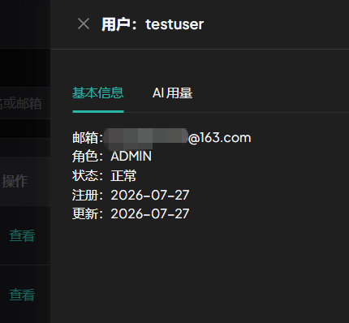

**可做什么：** 在 Drawer 中查看单用户档案（邮箱、角色、状态、注册/更新时间）。

#### 查看 · AI 用量

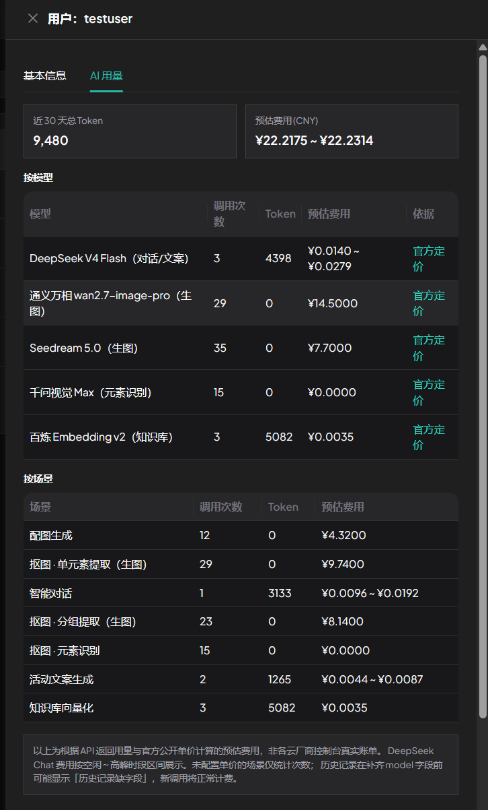

**可做什么：** 查看该用户 AI 调用汇总；按模型 breakdown（次数、Token、预估 CNY、定价依据）；按场景 breakdown。数据来自 `ai_call_log`。

---

### 可选补充

| 文件 | 说明 |
|------|------|
| `00-shell-sidebar.png` | README 首图：Sidebar + 任意主页面全貌 |
| `02-assets-list.png` | 素材 List 表格视图 |
| `04-chat-multimodal.png` | Chat 带参考图 |
| `06-matting-welcome.png` | 抠图欢迎页（未选任务） |

完整拍摄说明 → [`screenshots/README.md`](screenshots/README.md)

---

## 相关链接

- 仓库 README：[`../README.md`](../README.md)
- 架构：[`architecture.md`](architecture.md)
- 面试 STAR：[`interview.md`](interview.md)
- 部署：[`deploy.md`](deploy.md)
