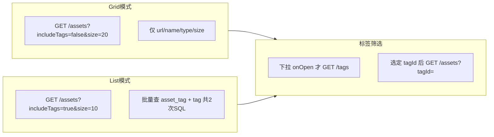

# AI Creative Workbench — 项目迭代计划表

> 更新日期：2026-09-08  
> 目标岗位：AI 应用前端 / AI 全栈（腾讯 AI 应用工程师、字节 AIGC / 飞书 Agent 全栈等）  
> 说明：本文仅作计划与验收清单；每项具体用 **Chat 带着做** 还是 **Agent 直接做**，实施时再定。

---

## 一、总览

| 阶段 | 主题 | 预估 | 核心产出 |
|------|------|------|----------|
| **Phase 1** | 亮点 + 作品化 | 5～7 天 | 公网 Demo、README、前端工程亮点、面试材料 |
| **Phase 1.5** | 性能 + 部署加固 | 2～3 天 | 素材 N+1 消除、懒加载、2G ECS 稳定 |
| **Phase 2** | RAG 扩展 PDF/DOCX | 2～3 天 | 知识库支持 pdf/docx 上传与问答 |
| **Phase 3** | JD 对齐增强 | 5～7 天 | AI 反馈闭环、Tool/MCP 实践、可选 Redis/CD |

**原则**

- 先能 **演示、能讲清**，再追 Agent / MCP 等关键词。
- 不堆 Nacos、Spring Cloud Gateway、Spring AI、Kafka 全链路。
- 手写 RAG 主线保留；LangChain/LangGraph 仅作实验分支，不整体替换。

---

## 二、已完成（不再重复做）

| 项 | 说明 |
|----|------|
| Docker 三镜像 | `backend-java` / `ai-service-python` / `frontend` Dockerfile |
| docker-compose 四服务 | MySQL + Java + Python + Nginx 前端 |
| 部署文档 | [`deploy.md`](deploy.md)（含常见问题） |
| GitHub Actions CI | [`.github/workflows/githubCI.yml`](../.github/workflows/githubCI.yml)，三 job 全绿 |
| 核心业务 | Chat SSE、RAG（md/txt）、美术机台、Campaign、AI 用量预估、管理后台 |
| Java + Python 架构 | BFF + AI 能力层，RestTemplate / FastAPI |
| **公网 Demo（HTTP）** | 阿里云轻量 `8.148.238.164:8088`；四容器 compose；uploads 同步；Swap + `JAVA_TOOL_OPTIONS`；nginx `/assets` 路由修复 |

---

## 三、Phase 1：亮点 + 作品化（优先全部完成）

### 3.1 公网 Demo

| 项 | 内容 |
|----|------|
| **状态** | **HTTP Demo 已完成** — http://8.148.238.164:8088 |
| **做什么** | 阿里云 ECS 轻量服务器 + `docker compose up` |
| **改什么** | 服务器上 `APP_PUBLIC_BASE_URL` / `APP_FRONTEND_BASE_URL` 改为公网 `:8088`；本机 `docker-compose.yml` 保持 `localhost` |
| **参考** | [`deploy.md`](deploy.md)；Phase 1.5 部署复盘见下文 |
| **验收** | 面试官可打开链接登录；Chat / 知识库 / 素材各测至少 1 次；素材页刷新无 502 |
| **安全** | 演示专用 API Key、演示账号；`.env`、`workbench_backup.sql` 不进 Git |

**可选子项 1-F（未做）：** 绑定域名 + HTTPS（Let's Encrypt）；简历可先写 HTTP Demo 链接。

### 3.2 README + 架构图 + 作品说明

| 项 | 内容 |
|----|------|
| **做什么** | 完善 [`README.md`](../README.md)；新增 `docs/portfolio.md` |
| **必含** | 项目定位、技术栈、Mermaid 架构图、3～5 张截图、启动方式、**公网 Demo 链接** |
| **作品说明结构**（对齐飞书等 JD「作品入口」） | ① 解决的问题 ② 个人贡献 ③ AI 方案 ④ 验证结果 ⑤ 一次关键迭代 |
| **验收** | 陌生人 5 分钟内能看懂项目并点开 Demo |

### 3.3 前端 Week 13 亮点

| 序号 | 任务 | 主要文件 | 验收标准 |
|------|------|----------|----------|
| 1 | Chat 消息虚拟列表 | `frontend/src/pages/ChatPage.tsx`（可参考 `VirtualAssetGrid`） | 长会话滚动流畅（如 1000 条不卡） |
| 2 | 路由 lazy load | `frontend/src/router/index.tsx` | `React.lazy` + `Suspense`，首屏 bundle 减小 |
| 3 | 统一错误体验 | `frontend/src/api/request.ts` + 关键页 | 401、网络超时、AI 失败、文件过大等有清晰提示 |
| 4 | 上传体验（可选） | `AssetUploadPage` | 进度条、大小限制提示 |

**刻意不做：** 通用 Canvas 图片预览器 —— 抠图裁切 `CropRegionEditor` 已可作为 Canvas 面试故事。

**素材页性能与懒加载**见 Phase 1.5 §4.2（O1～O6）；部署加固见 §4.3。

### 3.4 文档与面试材料

| 文件 | 内容 |
|------|------|
| `docs/architecture.md` | 正式架构说明（可扩展 `java-python-architecture.md`） |
| `docs/interview.md` | 8 个 STAR 故事：SSE、Java+Python、RAG、工作流、Docker/CI、用量计费等 |
| `docs/rag-eval.md` | RAG 策略与评测说明（chunk、TopK、bad case；Phase 2 后补充 PDF 案例） |

### Phase 1 完成标准

- [x] 公网 Demo 可访问（HTTP）
- [ ] 素材页刷新稳定、Grid 模式 API 无 N+1（Phase 1.5）
- [ ] README + portfolio 完成
- [ ] Chat 虚拟列表 + lazy 上线
- [ ] `interview.md` 可背诵级

---

## 四、Phase 1.5：性能与部署加固（Demo 复盘）

> 来源：2026-09-07 公网 Demo 联调踩坑；**本轮仅文档排期，实施按序号 3a～3c 动手**。

### 4.0 问题复盘（Incident → 根因 → 对策）

| 现象 | 根因 | 代码/运维对策 | 优先级 |
|------|------|---------------|--------|
| 登录 / API 502 | `application.yml` 密码含 `#` 未加引号，YAML 解析失败 | 仓库内用占位密码 + Docker env 覆盖；[`deploy.md`](deploy.md) 补充说明 | P0 |
| 图片空白 / 查看 502 | `APP_PUBLIC_BASE_URL` 指向 `:8080`，防火墙仅放行 `:8088` | 生产统一 `http://<IP>:8088`；本地/生产 compose 分离 | P0 |
| 刷新素材页 502 | React 路由 `/assets` 与 Vite 打包目录 `dist/assets/` 冲突 | [`frontend/nginx.conf`](../frontend/nginx.conf) 增加 `location = /assets`；长期改 `vite build.assetsDir` | P0 |
| 刷新后间歇 502 / SSH 卡死 | 2G 内存 + Grid 一次 40 条 + **N+1 查标签** + 40 张缩略图并发 | 见 §4.1 O1～O6；**禁止在 ECS 上 `docker build frontend`** | P0 |
| `/uploads` 404 返回 JSON | `GlobalExceptionHandler` 捕获过宽 | 静态资源 404 不走 `Result` JSON 包装 | P1 |
| 老素材无图 | 只导入 SQL，未同步 `uploads` volume | 部署检查清单：DB dump + `uploads` 目录 | P1 |

### 4.1 2G 轻量服务器运维备忘

| 项 | 建议 |
|----|------|
| Swap | 2G swapfile，`/etc/fstab` 持久化 |
| Java 堆 | `JAVA_TOOL_OPTIONS: "-Xmx512m -Xms256m"` |
| MySQL | 可选 `command: --innodb-buffer-pool-size=128M` |
| 构建前端镜像 | **本机** `docker build` → `docker save` → `scp` → 服务器 `docker load`（**临时方案，见 §4.4 CD**） |
| 仅改 nginx.conf | `docker cp` + `nginx -s reload`（临时）；正式应打入镜像 |
| 配置分离 | 仓库 [`docker-compose.yml`](../docker-compose.yml) 用 `localhost:8088`；服务器用 `docker-compose.prod.yml` 或 `.env` 覆盖公网 IP |

### 4.2 素材页 API / 前端优化（架构方案）

**现状（代码事实）：**

- [`AssetService.toAssetVO`](../backend-java/src/main/java/com/workbench/backendjava/service/AssetService.java) 每条素材调用 `loadTagsForAsset` → **N+1**（Grid 40 条 ≈ 80+ 次 SQL）
- Grid 视图 [`AssetGridCard`](../frontend/src/components/assets/AssetGridCard.tsx) **不展示标签**，但列表 API 仍返回 `tags`
- [`AssetListPage`](../frontend/src/pages/AssetListPage.tsx) 挂载时即 `listTagsApi()`，即使用户未打开筛选下拉
- [`VirtualAssetGrid`](../frontend/src/components/assets/VirtualAssetGrid.tsx) 已做 **DOM 虚拟化**，但 API 仍一次拉 `GRID_PAGE_SIZE=40` 条完整 `AssetVO`

**数据流（目标态）：**



| 序号 | 任务 | 层级 | 做法 | 验收 |
|------|------|------|------|------|
| **O1** | 列表默认不带 tags | 后端 | `GET /api/assets` 增加 `includeTags`（默认 `false`）；Grid 不传或传 false | Grid 请求 SQL 仅 1 次分页查询 |
| **O2** | 批量加载 tags | 后端 | `includeTags=true` 时：一次 `asset_tag WHERE asset_id IN (...)` + 一次 `tag WHERE id IN (...)`，内存组装 Map | List 模式 10 条仍 ≤3 次 SQL |
| **O3** | 标签下拉懒加载 | 前端 | [`ToolBar`](../frontend/src/components/assets/ToolBar.tsx) `Select` 的 `onOpenChange` 触发 `listTagsApi`；移除 AssetListPage 挂载即请求 | 首屏少 1 个 API |
| **O4** | 按视图区分请求 | 前端 | Grid：`includeTags=false`，`size` 降至 20；List：`includeTags=true`，`size=10` | Grid 刷新 ECS 内存占用明显下降 |
| **O5** | 编辑弹窗 tags | 前端 | [`EditAssetModal`](../frontend/src/components/assets/EditAssetModal.tsx) 打开时再拉 tags + asset 详情 | 不在列表阶段预加载 |
| **O6** | 虚拟列表与分页对齐 | 前端 | 保留 VirtualAssetGrid；无限滚动与 virtualizer `overscan` 协调，避免一次 append 40 条 | 滚动流畅且单次 payload 可控 |
| **O7** | 按可见 id 拉取（可选） | 前后端 | 新 API `GET /assets?ids=` 或 cursor；复杂度高 | Phase 1.5 后期或 Phase 2 前视情况 |

**设计说明（参考产品思路，架构定稿）：**

- **按 tag 筛选**：已有 `tagId` 参数在 SQL 层过滤，**无需**在每条 asset 上再查关联。
- **用户未打开标签下拉**：不请求 `/api/tags`（O3）。
- **Grid 不看标签**：列表 API 不带 tags（O1 + O4），与「用到再请求」一致。
- **List / 编辑需要标签**：`includeTags=true` 或弹窗内单独请求（O2 + O5）。

### 4.3 其它前端 / 后端加固（与 Phase 1 §3.3 衔接）

| 序号 | 任务 | 主要文件 | 验收 |
|------|------|----------|------|
| F1 | Chat 消息虚拟列表 | `frontend/src/pages/ChatPage.tsx` | 长会话滚动流畅 |
| F2 | 路由 lazy load | `frontend/src/router/index.tsx` | 首屏 bundle 减小 |
| F3 | 缩略图 URL 归一化 | `AssetGridCard` + `normalizeMediaUrl` | 生产环境图片正常 |
| F4 | 统一 502 / 超时提示 | `frontend/src/api/request.ts` | 错误信息可理解 |
| D1 | nginx `/assets` 打入镜像 | `frontend/nginx.conf` + 本机构建 | 重建容器后刷新仍 200 |
| D2 | compose 本地/生产分离 | `docker-compose.prod.yml` 或 `.env` | 仓库不含公网 IP |
| D3 | 静态资源 404 不返回 JSON | `GlobalExceptionHandler.java` | `curl` 缺图返回 404 非 JSON |

### Phase 1.5 完成标准

- [ ] O1～O2 上线，Grid 模式后端 SQL ≤1 次分页 + 统计
- [ ] O3～O6 上线，素材页首屏 API 数减少
- [ ] 2G ECS 上素材页连续刷新 10 次无 502
- [ ] D1～D2 部署配置规范化（D3 可选）
- [ ] **§4.4 CD 排期确认**（实施可放在 Phase 1 收尾或 Phase 2 前）

### 4.4 CD 自动化部署（GitHub Actions → ECS）

> **背景：** 当前公网更新依赖本机 `docker build` → `docker save` → `scp`（大文件易断）→ ECS `docker load` → `docker compose up`，步骤多、易出错。**已有 CI**（[`.github/workflows/githubCI.yml`](../.github/workflows/githubCI.yml) 三 job 编译），**缺 CD**（push 后自动部署）。

**目标：** `git push main`（或手动 workflow）→ 自动构建三镜像 → SSH 部署 ECS → `docker compose` 滚动更新，**不再手传 tar**。

| 序号 | 任务 | 内容 | 验收 |
|------|------|------|------|
| **CD1** | 部署 Workflow | 新建 `.github/workflows/deploy.yml`：`workflow_dispatch` + 可选 `push` tag/`main` | Actions 页可一键 Deploy |
| **CD2** | 远程构建镜像 | Runner 上 `docker build`（backend 用 `Dockerfile.runtime` 或带阿里云 Maven mirror 的多阶段 Dockerfile；frontend/ai 照旧） | 三镜像 build 成功 |
| **CD3** | SSH 部署 ECS | GitHub Secrets：`ECS_HOST`、`ECS_USER`、`ECS_SSH_KEY`；SSH 执行 `git pull` + `docker compose -f docker-compose.yml -f docker-compose.prod.yml pull/up` 或 `load` 后 `up -d` | push 后 Demo 自动更新 |
| **CD4** | 文档与回滚 | [`deploy.md`](deploy.md) 补充 CD 说明、Secrets 配置、失败回滚（保留上一版镜像 tag） | 他人可按文档复现 |

**不在 CD 首版范围：**

- uploads / DB 自动同步（仍手动或单独脚本）
- 多环境（staging/prod 两套 ECS）
- Kubernetes

**依赖：** #1 Demo 稳定、D2 `docker-compose.prod.yml` 已用、3a～3b 核心功能已部署验证。

**预估：** 0.5～1 天（含 Secrets 与首次联调）。

**面试一句话：**

> CI 保证合并前编译通过；CD 通过 GitHub Actions SSH 到轻量 ECS，构建 Docker 镜像并 compose 更新，替代手工 scp 分卷传输。

---

## 五、Phase 2：RAG 支持 PDF / DOCX

### 5.1 现状

| 层级 | 位置 | 现状 |
|------|------|------|
| Python | `ai-service-python/app/services/document_parser.py` | 仅 `.md` / `.txt` / `.markdown`，UTF-8 解码 |
| Java | `KnowledgeDocumentService.java` | 同上校验 |
| 前端 | `KnowledgePage.tsx`、`KnowledgeDocumentListPage.tsx` | `accept` 与文案仅 txt/md |
| 链路 | Java 存文件 → Python `indexDocument` | 二进制已传递，瓶颈在 Python 文本解析 |

### 5.2 技术方案

```
上传文件
  → 按后缀分支解析
      .txt / .md / .markdown  → UTF-8（现有）
      .pdf                    → pypdf 或 pymupdf 提取纯文本
      .docx                   → python-docx 提取段落文本
  → split_text → embed → Chroma（不变）
```

**本阶段边界（写进文档，避免 demo 翻车）**

- 不支持扫描版 PDF（无 OCR）。
- 不支持加密 PDF。
- DOCX 仅提取段落文本，复杂表格/图片忽略。
- 超大文件设字符/页数上限，与 upload max-size 对齐。

### 5.3 预计改动文件（实施时用，现在不动代码）

| 优先级 | 文件 |
|--------|------|
| P0 | `ai-service-python/app/services/document_parser.py` |
| P0 | 新建 `ai-service-python/app/services/binary_document_extractor.py` |
| P0 | `ai-service-python/requirements.txt`（`pypdf`、`python-docx` 等） |
| P0 | `backend-java/.../KnowledgeDocumentService.java` |
| P0 | `frontend/.../KnowledgePage.tsx`、`KnowledgeDocumentListPage.tsx` |
| P1 | `KnowledgeDocumentEditorPage` — PDF/DOCX 仅索引，编辑器只读或不可编辑 |
| P1 | `docs/deploy.md`、Docker 镜像 rebuild |

### 5.4 验收标准

- [ ] 上传 `.pdf`、`.docx` 成功，`chunk_count > 0`
- [ ] 知识库问答能引用 PDF/DOCX 内容（references 含文件名）
- [ ] 原有 md/txt 仍正常
- [ ] 空 PDF / 加密 PDF / 扫描版有明确错误提示
- [ ] Docker 环境 rebuild 后可用

### 5.5 面试一句话

> RAG 入库统一为 plain text 流水线；解析层按后缀插件化，PDF/DOCX 提取后再 chunk+embed；文本格式可编辑，二进制格式仅上传索引。

---

## 六、Phase 3：JD 对齐增强（Phase 1～2 后再做）

依据 [`JD.md`](JD.md) 与岗位投递方向。

### 6.1 AI 反馈闭环

| 项 | 内容 |
|----|------|
| **范围** | Chat / RAG / 生图：点赞点踩，或「重新生成原因」 |
| **参考** | study-plan Week12 周日（尚未实现） |
| **数据** | 扩展 `ai_call_log` 或新建轻量 `ai_feedback` 表 |
| **验收** | 能统计反馈分布，面试能讲「效果闭环」 |

### 6.2 Agent 关键词 — 三选一

| 选项 | 预估 | 简历标签 | 说明 |
|------|------|----------|------|
| **C1 Tool Calling（推荐）** | 3 天 | Tool Use | Python 工具注册表：`search_knowledge`、`generate_image` 等 |
| **C3 MCP 最小 Server** | 3 天 | MCP / Skills | 暴露「查知识库」等工具，对齐字节 JD |
| C2 LangGraph 实验分支 | 5 天 | LangGraph | 独立 git 分支，Campaign 单 Agent 图，**不合并主线** |

### 6.3 可选增强

| 项 | 何时做 |
|----|--------|
| GitHub Actions CD（SSH 部署 ECS） | 见本文 **§4.4、序号 3d** | Demo 稳定后，约 0.5～1 天 |
| Redis 单场景（限流 / 热点缓存） | 投顺丰等中厂 JD 前，约 1 天 |
| CI 升级 `setup-java@v5` 等 | 顺手 |

### 6.4 明确不做（除非改投 Java 微服务岗）

- Nacos / Spring Cloud Gateway
- Spring AI（与 Python AI 层重复）
- Kafka 消息队列全链路
- 用 LangChain **整体替换** 现有手写 RAG
- 完整多 Agent 协作平台

---

## 七、岗位投递节奏

| 完成阶段 | 适合投递 | 叙事重点 |
|----------|----------|----------|
| Phase 1 结束 | 腾讯 **AI 应用工程师**；字节 **AIGC 全栈 / AI 前端** | 全栈 Demo + SSE + RAG + 工作流 + Docker/CI |
| Phase 2 结束 | 同上 | 增加「多格式文档 RAG」 |
| Phase 3（C1 或 C3）后 | 字节 **飞书 Agent 全栈**、平台 AI 岗 | 增加 Tool/MCP + 反馈闭环 |
| Agent 专岗 | stretch | 需 LangGraph 深度 + Agent 专向作品 |

**主简历叙事**

> AI 创意工作台：React + Spring Boot + FastAPI；RAG 知识问答、SSE 对话、美术机台与运营文案 AIGC 流水线；Docker + GitHub Actions CI；[公网 Demo 链接]

**副叙事（Phase 3 后追加）**

> Tool Calling / MCP 实践；AI 反馈与 RAG 评测说明。

---

## 八、执行顺序（一张表）

| 序号 | 任务 | 阶段 | 依赖 | 状态 |
|------|------|------|------|------|
| 1 | 公网 Demo（HTTP） | P1 | Docker 已有 | ✅ |
| 1-F | 域名 + HTTPS（可选） | P1 | #1 | ⬜ |
| 3a | O1～O2 素材列表 API 去 N+1 | P1.5 | #1 稳定 | ✅ |
| 3b | O3～O6 素材页前端懒加载 / 分页 / 批量删除 | P1.5 | 3a | ✅ |
| 3c | D1～D3 部署加固 | P1.5 | #1 | ✅（D3 可选 ⬜） |
| **3d** | **CD1～CD4 GitHub Actions 部署 ECS** | **P1.5→P1** | **3c、Demo 稳定** | **⬜ 已排期** |
| 3 | Chat 虚拟列表 + lazy + 错误体验 | P1 | 可与 3a 并行 | 🔄 虚拟列表 ✅；lazy/错误 ⬜ |
| 2 | README + portfolio + architecture | P1 | #1 有 Demo 链接 | ⬜ |
| 4 | interview.md + rag-eval 骨架 | P1 | #2 | ⬜ |
| 5 | PDF/DOCX 解析（Python） | P2 | P1.5 核心完成 | ⬜ |
| 6 | Java + 前端格式对齐 | P2 | #5 | ⬜ |
| 7 | 联调 + Docker rebuild + 文档更新 | P2 | #6 | ⬜ |
| 8 | AI 反馈闭环 | P3 | #7 | ⬜ |
| 9 | Tool Calling 或 MCP（二选一） | P3 | #8 | ⬜ |
| 10 | Redis（可选） | P3 | 按需 | ⬜ |

**建议实施顺序：** 3（Chat lazy + 错误 UX 收尾）→ 2 → **3d（CD）** → 4 → Phase 2

**说明：** #1 HTTP Demo 已完成；3a～3c 核心已完成。**下一步优先收尾 Chat #3，随后 README；CD（3d）建议在 README 前或 Phase 2 前完成，避免再次手工 scp 镜像。**

---

## 九、架构与 JD 关键词对照（备忘）

| JD 常写 | 本项目 | 计划后 |
|---------|--------|--------|
| RAG | 手写 embed + Chroma + prompt | + PDF/DOCX |
| SSE / 流式 | Chat 已有 | 保持 |
| 全栈交付 | 三端 + Docker | + 公网 Demo |
| Agent / Tool Use | 弱（工作流像流水线） | Phase 3 C1/C3 |
| MCP / Skills | 无 | Phase 3 C3 或 Cursor Rules 文档化 |
| LangGraph | 无 | 仅 C2 实验分支（可选） |
| 微服务 / Nacos | compose + 服务名，无注册中心 | **不做** |
| Redis / MQ | 无 | Redis 可选；MQ 仅口述扩展 |
| CI/CD | CI 已有 | **CD 已排期 §4.4（3d）** |

---

## 十、风险与范围控制

1. **PDF 扫描件**：无 OCR 会提取失败 — UI 必须提示。  
2. **大 PDF**：需上限，避免 embed 超时。  
3. **Phase 1.5 核心（3a～3b）未完成前慎加新重接口** — 2G Demo 机易再现 OOM / 502。  
4. **Phase 1 未完成前不启动 Phase 3** — 避免「功能很多但没有可点的 Demo」。  
5. **数据库备份 `workbench_backup.sql`** — 勿提交 Git；`*.tar`、`*.part_*` 等部署产物勿提交。  
6. **手动 scp 镜像** — 仅 CD（3d）完成前的临时方案；见 §4.4。  
7. **实施方式** — 每项开始前决定：Chat 分步学习 vs Agent 批量实现。

---

## 十一、相关文档索引

| 文档 | 用途 |
|------|------|
| [`deploy.md`](deploy.md) | Docker 部署与故障排查；生产 2G ECS 细节见本文 §4.1 |
| 本文 §4.0～§4.4 | Demo 踩坑复盘、素材页优化、**CD 自动化排期** |
| [`JD.md`](JD.md) | 目标岗位 JD 汇总 |
| [`ai-pricing-sources.md`](ai-pricing-sources.md) | AI 用量计费出处 |
| [`java-python-architecture.md`](java-python-architecture.md) | Java + Python 分工草稿 |
| [`study-plan.md`](study-plan.md) | 原始周计划（Week 13～14） |

---

*实施建议从 **序号 3a**（素材 API 去 N+1）或 **序号 3**（Chat 虚拟列表）开始；需要动手时说明序号即可。*
