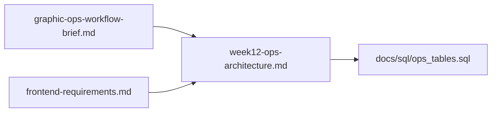
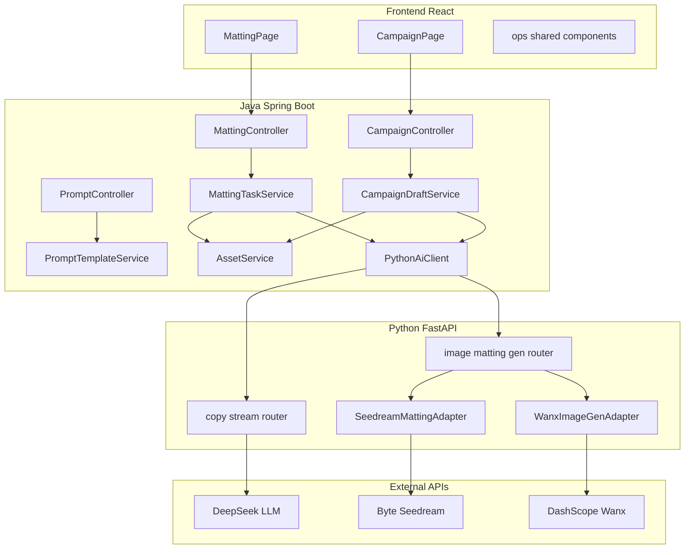
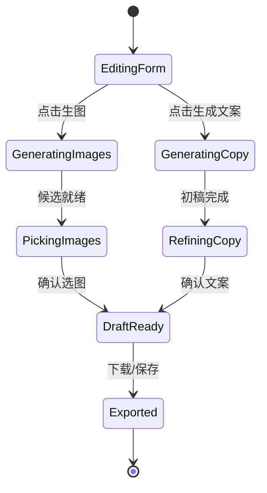

# Week 12 图文运营 — 技术架构

> **实现期 Single Source of Truth。** 产品场景见 [`graphic-ops-workflow-brief.md`](graphic-ops-workflow-brief.md)；UI 块级规格见 [`frontend-requirements.md`](frontend-requirements.md) §4.8–4.9、§7.8–7.9；视觉对照 `http://localhost:5173/style-preview.html` Ops 区块。

---

## 1. 文档关系



| 文档 | 职责 |
|------|------|
| Brief | 产品场景、双模块关系、P0–P4 优先级、MVP 验收 |
| Requirements | 页面线框、组件映射、Step 10 拆解、验收清单 |
| **本文档** | 分层架构、表结构、API 契约、Phase 路线图、开放问题 |
| `ops_tables.sql` | 实现 Phase 0 时执行的 DDL（本文档 §3 为说明版） |

---

## 2. 模块与路由

两个**独立**产品面，Sidebar 与 Chat / Knowledge 并列：

| 模块 | 路由 | 核心 UX | 主实体 |
|------|------|---------|--------|
| **Matting** 抠图工作台 | `/ops/matting` | TaskSidebar + 四步 StepNav → 候选画廊 → 入库 | `ops_matting_task` |
| **Campaign** 活动帖 | `/ops/campaign` | 左表单 ~360px + Tab（配图 \| 文案 \| 预览）→ 草稿包 / zip | `campaign_draft` |

**共用组件**（目标目录 `frontend/src/components/ops/`）：

| 组件 | 用途 |
|------|------|
| `TaskSidebar` | Matting 任务侧栏（260px） |
| `StepNav` | Matting 四步水平导航 |
| `CandidateGallery` | 多候选网格（checkerboard 透明底） |
| `ImageSourcePanel` | 上传 / 素材库·已有 / 素材库·AI 入库（三态） |
| `TagAssetDialog` | AI 候选打标入库 |
| `OpsDialog` | 新建/重命名任务 |
| `HistoryDrawer` | 历史生成列表 |
| `CampaignPostCard` | 牛客帖预览卡片（16:9 封面 + 标题 + 正文） |

**硬规则：**

- 禁止 `import Preview*` 到 `pages/` 或业务组件
- 文案输出用 **prose 块**（可参考 `AnswerRenderer`），不用 Chat 气泡
- 资产类型用现有 **Tags**（`matted` / `generated` / `reference` / `活动`），**不新增** `assetType` 列

---

## 3. 系统分层



### 3.1 职责划分

| 层 | 职责 | 对齐现有模式 |
|----|------|--------------|
| **前端** | 表单、步骤、画廊、SSE 消费、草稿预览 | 同 `ChatPage` / `KnowledgePage` |
| **Java** | 鉴权、MySQL 持久化、任务/草稿状态、SSE 转发、Asset 落盘 | 同 `ChatService` + `ConversationService`；复用 [`AssetService`](../backend-java/src/main/java/com/workbench/backendjava/service/AssetService.java) |
| **Python** | Prompt 渲染、LLM 流式、**外部图像 API 适配**（Java 不直连第三方） | 同 `llm_service.py` + chat stream router |

### 3.2 与 Chat / Knowledge 的差异

| 维度 | Chat | Ops 工作流 |
|------|------|------------|
| 交互 | 开放式多轮 | 结构化表单 + 分步 |
| 产出 | 任意文本 | 草稿包（文案 + 选定配图） |
| Prompt | 用户即兴 | `prompt_template` + 变量 |
| 持久化 | conversation / message | campaign_draft、ops_matting_task、generation_job |

---

## 4. 数据模型

实现 Phase 0 时执行 [`docs/sql/ops_tables.sql`](sql/ops_tables.sql)。以下为字段说明。

### 4.1 `prompt_template`

| 字段 | 说明 |
|------|------|
| `user_id` | NULL = 系统内置 |
| `name` | 展示名 |
| `scene` | `matting` \| `image_gen` \| `copy_draft` \| `copy_style_playful` \| `copy_style_formal` \| … |
| `content` | 含 `{{variable}}` 占位符 |

### 4.2 `ai_call_log`

全链路审计：scene、prompt、response、model、cost_ms。每次 LLM / 抠图 / 生图调用写入。

### 4.3 `ops_matting_task`

| 字段 | 说明 |
|------|------|
| `title` | 任务名 |
| `stage` | 1–4，对应 UI StepNav |
| `status` | `draft` \| `running` \| `done` |
| `source_asset_id` | 步骤 ① 选定源图 |
| `config_json` | 模板 id、prompt、模型、框选区域（可选） |
| `selected_candidate` | 步骤 ③ 选中候选（URL 或临时 id） |

### 4.4 `generation_job`

一次 generate 请求（抠图或生图共用）：

| 字段 | 说明 |
|------|------|
| `job_type` | `matting` \| `image_gen` |
| `ref_task_id` | 关联 `ops_matting_task.id`（抠图） |
| `ref_draft_id` | 关联 `campaign_draft.id`（生图） |
| `status` | pending / running / done / failed |
| `input_json` | 源 asset、prompt、模型参数 |
| `candidates_json` | 候选 URL 列表 |
| `selected_ids` | 用户选中项 |

### 4.5 `campaign_draft`

| 字段 | 说明 |
|------|------|
| `title` | 草稿标题（可取活动主题） |
| `activity_json` | 活动表单快照（主题、时间、福利、受众、风格、画幅等） |
| `copy_title`, `copy_body` | 定稿文案 |
| `cover_asset_id` | 主封面 |
| `image_asset_ids` | 附图 JSON 数组 |
| `status` | `draft` \| `ready` |

### 4.6 草稿包逻辑结构（导出 / 预览）

```json
{
  "title": "活动标题",
  "body": "正文 Markdown/纯文本",
  "images": [{ "assetId": 123, "url": "...", "role": "cover" }],
  "activityMeta": { "theme": "...", "audience": "...", "forbiddenWords": [] },
  "status": "draft"
}
```

---

## 5. 外部 API 策略

| 能力 | Provider | 配置（Python `.env`） | Phase |
|------|----------|----------------------|-------|
| 文案初稿 / 优化 | DeepSeek（现有） | 已有 LLM 配置 | 1 |
| **抠图** | **字节 Seedream** | `SEEDREAM_*` | 2 |
| **生图** | **通义万相 DashScope** | `DASHSCOPE_API_KEY` | 2 |

**原则：**

- Java **不持有**图像 API Key
- Python 侧预留 `ImageProvider` 接口，便于后续增即梦等
- 单次生图上限 N 张（建议 4）；抠图多候选上限 M 张（建议 4）
- 失败可重试，一律记 `ai_call_log`

---

## 6. API 契约

### 6.1 Prompt 管理

| 方法 | 路径 | Phase |
|------|------|-------|
| GET | `/api/prompts?scene=copy_style_playful` | 0 |
| POST | `/api/prompts` | 0 |
| PUT | `/api/prompts/{id}` | 0 |
| DELETE | `/api/prompts/{id}` | 0 |

### 6.2 Campaign

| 方法 | 路径 | 说明 | Phase |
|------|------|------|-------|
| POST | `/api/ops/campaign/draft` | 创建草稿 | 1 |
| PUT | `/api/ops/campaign/{id}` | 更新 activity_json 等 | 1 |
| GET | `/api/ops/campaign/{id}` | 读取草稿 | 1 |
| POST | `/api/ops/campaign/{id}/generate-copy` | **SSE** 文案；body: `{ mode: "draft"\|"refine", styleTemplateId?, hint? }` | 1 |
| POST | `/api/ops/campaign/{id}/generate-images` | 生 4 张候选 | 4 |
| GET | `/api/ops/campaign/{id}/export` | zip（文案 + 图片） | 4 |

**generate-copy SSE 格式：** 与 Chat 一致，JSON chunk `{ "content": "..." }`，结束 `{ "done": true }`。

### 6.3 Matting

| 方法 | 路径 | 说明 | Phase |
|------|------|------|-------|
| GET | `/api/ops/matting/tasks` | 任务列表 | 3 |
| POST | `/api/ops/matting/tasks` | 新建任务 | 3 |
| GET | `/api/ops/matting/tasks/{id}` | 任务详情 | 3 |
| PATCH | `/api/ops/matting/tasks/{id}` | 更新 stage / config_json | 3 |
| POST | `/api/ops/matting/tasks/{id}/generate` | 调抠图 → 写 generation_job | 3 |
| POST | `/api/ops/matting/tasks/{id}/save` | 选中候选 → Asset + tag `matted` | 3 |
| GET | `/api/ops/matting/tasks/{id}/history` | 历史 generation_job | 3 |

### 6.4 Python 内部（Java 经 `PythonAiClient` 调用）

| 方法 | 路径 | 说明 | Phase |
|------|------|------|-------|
| POST | `/ai/ops/render-prompt` | 模板 + variables → final prompt | 0 |
| POST | `/ai/ops/copy/stream` | 活动文案 SSE（或复用 chat stream + 专用 system prompt） | 1 |
| POST | `/ai/ops/matting` | 抠图 → candidate URLs | 2 |
| POST | `/ai/ops/image-gen` | 生图 → candidate URLs | 2 |

**matting / image-gen 请求示例：**

```json
{
  "sourceUrl": "https://...",
  "prompt": "提取吉祥物，透明背景",
  "model": "seedream-default",
  "count": 4
}
```

**响应示例：**

```json
{
  "jobId": "uuid",
  "candidates": [{ "url": "https://...", "index": 0 }]
}
```

---

## 7. 开发分期

**已确认顺序：** Campaign 文案 → 共用组件 + 图像 API → Matting 四步 → Campaign 配图/导出。

实现时 **Chat（导师 sub-step）或 Agent 由你自行选择**，本文档不指定分工。

| Phase | 目标 | 主要交付 |
|-------|------|----------|
| **0** | 基础设施 | `ops_tables.sql`；`PromptController` + seed 模板；Python render-prompt；路由 `/ops/*` + Sidebar 入口；Seedream/DashScope adapter **骨架** + 健康检查 |
| **1** | Campaign 文案 P0 | `CampaignDraftService`；`generate-copy` SSE；`CampaignPage` 左表单 + **文案 Tab**；预览 Tab 静态 PostCard |
| **2** | 共用图像链路 | `ImageSourcePanel`、`CandidateGallery`；真实 Seedream / DashScope 调用；`generation_job`；`TagAssetDialog` + 保存 Assets |
| **3** | Matting 四步 | `MattingPage` 空态 → 四步；TaskSidebar CRUD；generate/save → Assets `matted` |
| **4** | Campaign 完整 | 配图 Tab（三态含 library-ai）；预览 Tab + `CampaignPostCard`；zip export |
| **5**（可选） | 增强 | `HistoryDrawer`；Matting 框选；牛客发帖 API；Prompt 管理 UI |

### 7.1 前端 Step 拆解（requirements §6.2）

```
10a  ops/ 共用：StepNav、CandidateGallery（静态对照 style-preview）
10b  CampaignPage 骨架：左表单 + 右 Tabs 空壳
10c  Campaign 文案 Tab 联调 SSE（Phase 1）
10d  ImageSourcePanel + TagAssetDialog（Phase 2）
10e  MattingPage：Welcome + StepFrame + TaskSidebar（Phase 3）
10f  Matting 四步 + generate/save 联调
10g  Campaign 配图 Tab + PostCard 预览 + export
```

每步对照 §7.8 / §7.9 验收清单 + style-preview Ops 区块。

### 7.2 Campaign 人机协同状态机



---

## 8. ai-center 借鉴边界

参考路径：`e:\font\.ai_completion\ai-center`（美术机台 / slots）

| 借鉴 | 不借鉴 |
|------|--------|
| `SlotsService` 多候选 plan、history | `artMachineSlotsStore` 1300+ 行 Pinia |
| `slots_prompt` 抠图 prompt 文案 | Vue 机台 UI / 暗色主题 |
| `Stage4PickPanel` 画廊交互概念 | sessionStorage 任务镜像 |
| Seedream / 模型选择配置思路 | 五阶段完整机台 UX |

**五阶段 → 本项目映射：**

| ai-center | 本项目 |
|-----------|--------|
| ① GENERATE 文+参考图生整图 | 模块 B 生图 |
| ② CROP 区域切割 | 可选简化；MVP 可跳过 |
| ③ EXTRACT_EDIT 抠图 | **模块 A** 核心 |
| ④ SELECT 多候选 | **A/B 共用** CandidateGallery |
| ⑤ EXPORT 打包 | **模块 B** zip 草稿包 |

运营图文抽取：**多候选生成 → 挑选 → 入库 → 打包**。

---

## 9. 前端文件规划

| 路径 | 说明 |
|------|------|
| `frontend/src/pages/MattingPage.tsx` | 抠图主页面 |
| `frontend/src/pages/CampaignPage.tsx` | 活动帖主页面 |
| `frontend/src/components/ops/*` | 共用 Ops 组件 |
| `frontend/src/api/ops.ts` | Matting / Campaign API |
| `frontend/src/api/prompts.ts` | Prompt CRUD |
| `backend-java/.../controller/OpsMattingController.java` | Matting REST |
| `backend-java/.../controller/OpsCampaignController.java` | Campaign REST |
| `backend-java/.../controller/PromptController.java` | Prompt REST |
| `ai-service-python/app/routers/ops.py` | Ops Python 路由 |
| `ai-service-python/app/services/ops/` | render、matting、image-gen adapters |

---

## 10. 开放问题

| # | 问题 | 影响 Phase |
|---|------|------------|
| 1 | Seedream 抠图具体 endpoint / 文档 | 2 |
| 2 | `DASHSCOPE_API_KEY` 申请与 `.env` 配置 | 2 |
| 3 | Matting 步骤 ② **框选区域**：MVP 整图抠图 vs 必须框选 | 3 |
| 4 | `library-ai`（素材库内 AI 生图入库）：Phase 2 做组件，Phase 4 做 Campaign 内完整流程 | 2 / 4 |
| 5 | 牛客发帖 API（P4 扩展） | 5 |

---

## 11. MVP 验收（技术视角）

- [ ] `/ops/matting`：四步流 + 保存 Assets，`matted` 标签可筛
- [ ] `/ops/campaign`：活动表单 + 文案初稿/风格优化 SSE + 配图候选 + 预览 + zip
- [ ] `prompt_template` CRUD + 至少 2 个内置 scene
- [ ] `ai_call_log` 覆盖 LLM / 抠图 / 生图
- [ ] UI 与 Chat 一眼可区分（表单 + 画廊，非对话线程）
- [ ] 模块 A 抠图产物可被模块 B 参考图选用

---

## 12. 修订记录

| 日期 | 内容 |
|------|------|
| 2026-08-29 | v1：从 Week 12 计划 + Brief 提炼；确认 Campaign 文案先行、Seedream + DashScope |
